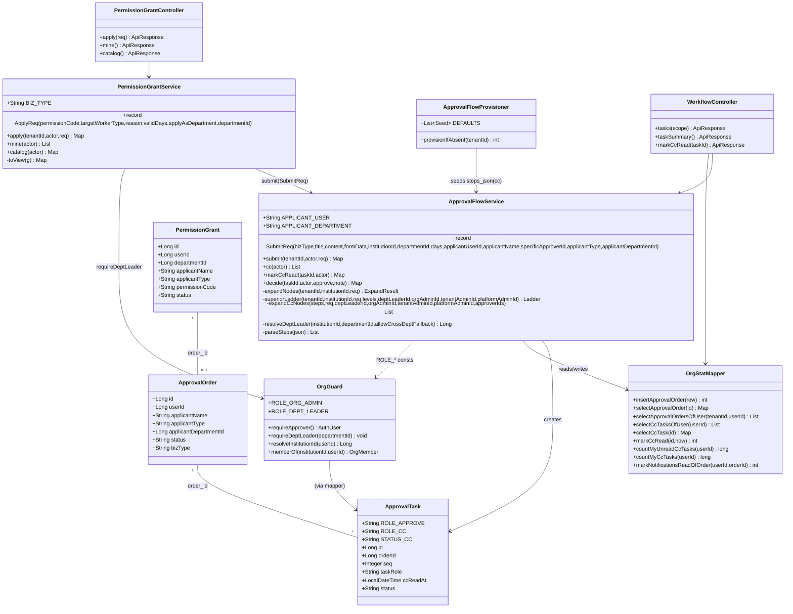
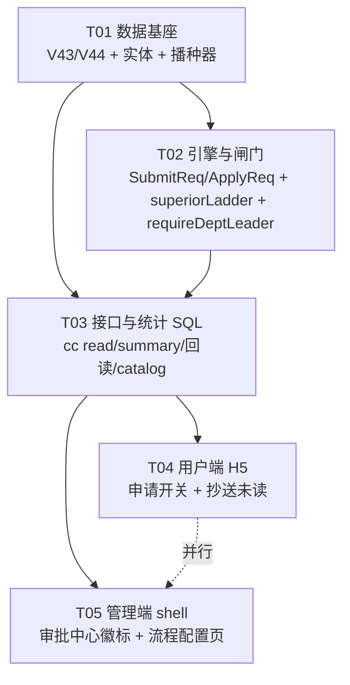
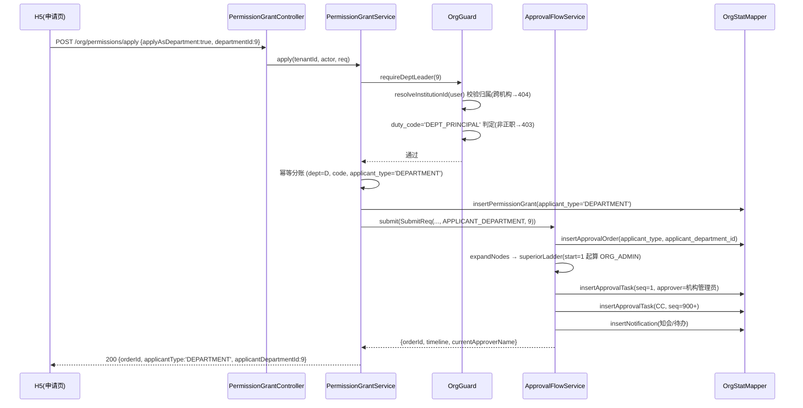
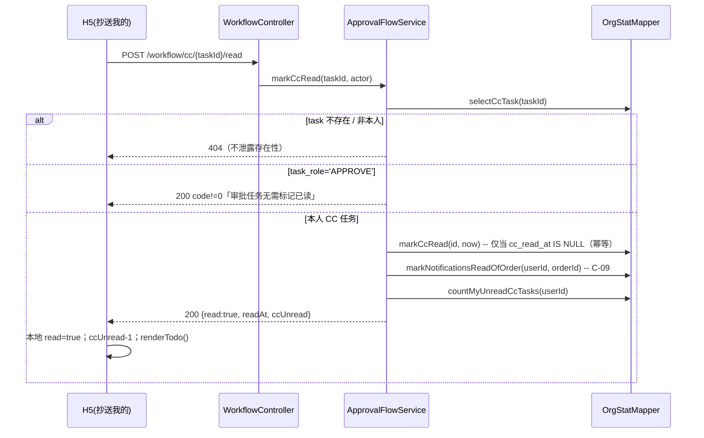

# 26 · 权限审批与组织关联改造 · 二期 + 三期增量架构设计

| 项 | 内容 |
|---|---|
| 文档版本 | v1.0（增量架构设计 + 任务分解） |
| 日期 | 2026-09-16 |
| 作者 | 高见远（架构师） |
| 唯一需求输入 | `docs/25-权限审批与组织关联改造二期三期增量PRD.md`（E-01..E-10 / C-01..C-12 / A2-1..A2-6 / A3-1..A3-9 / §8 三条输入要点） |
| 上位依据 | `docs/23-…改造方案.md`（§4 P3/P4、§8、§9）；`docs/24-…一期验收报告.md` |
| 范围 | 只做 **二期 P3（部门作为申请主体）** 与 **三期 P4 完整版（知会通用化 + 待阅已读态）**；四期 `ApproverResolver` / 五期并行路由**不做** |
| 基线事实 | 一期已全量回归零回归；`db/migration` 实际最大版本 **V42**（已 `ls | sort -V | tail -3` 核实） |
| 编程栈 | 沿用：Vue3 shell + SpringBoot 单体（`server/`，`mvnw`）+ MySQL8（`aioa`）+ FastAPI + 单文件 H5 |

---

## Part A · 系统设计

### 1. 实现方案与关键决策

#### 1.1 总原则（PRD §8 三条要点直接落为设计约束）

1. **引擎改动集中、不加第二套实现**：二期全部落在 `ApprovalFlowService.superiorLadder()` 的一个分支；三期 `expandCcNodes()` 已与业务类型解耦，**只补已读态**，不重写。
2. **新增字段全部可缺省**：`applicant_type` / `applicant_department_id` / `cc_read_at` / `applyAsDepartment` / `departmentId` / `ccUnread` —— 缺省（不传 / `null` / `false`）必须与一期**逐字等价**。
3. **迁移只追加 + 回填只补空**：`V43` DDL、`V44` 回填；落地前重新取实际最大版本 +1。

#### 1.2 二期（P3）改动点与取舍

| 改动点 | 决策 | 为什么这么定 |
|---|---|---|
| 单据主体字段 | `approval_order` 增 `applicant_type`（`USER`\|`DEPARTMENT`，默认 `USER`）+ `applicant_department_id`（可空） | E-01。默认 `USER` 使历史行与旧接口逐字等价，零迁移风险 |
| 请求体扩展 | `ApplyReq` 增 `applyAsDepartment`（`Boolean`）+ `departmentId`（`Long`）；`SubmitReq` 增 `applicantType` + `applicantDepartmentId` | E-02。**record 全参构造无默认值** → 5 个构造点必须同步（见 §4.1） |
| 发起闸门 | `OrgGuard.requireDeptLeader(Long departmentId)` 新建 | E-03/E-05。判定口径**只认 `org_member.duty_code='DEPT_PRINCIPAL'`**，回落 `org_department.leader_user_id`；**`job_title` 不作权限依据** |
| 审批链起点 | `superiorLadder()` 内加 `applicant_type='DEPARTMENT'` → 起点 = `ORG_ADMIN` 梯级（跳过 `DEPT_LEADER`） | E-04/D-2。提交人即部门负责人，从机构管理员起算；**复用**同一函数的自审防护与 `levels` 截断，不新开分支实现 |
| 自审防护可见化 | `superiorLadder` 自审跳过分支补 `note`（仅 `levels` 受限时） | D-2/A2-2 要求「提交人若同时是机构管理员则顺延并写明原因」 |
| 幂等分账 | `permission_grant` 增 `applicant_type`（默认 `USER`）；部门申请按 `(department_id, permission_code, applicant_type='DEPARTMENT')` 判重，个人按 `(user_id, permission_code, applicant_type='USER')` | E-08（P1）。**不新增此列则无法分账** —— 若部门申请与个人申请的 `user_id`/`department_id` 完全相同（提交人即负责人、同为本人部门），数据库层无法区分两者 |
| 授权对象 | 审批通过后 `permission_grant` 授权对象**仍为提交人本人**，`DbPermissionResolver` 不变 | Q-2 已锁定：本阶段「以部门名义」只改主体与审批链起点，不改发放对象 |
| 前端 H5 | 申请页加开关 + 部门选择；单据加「部门申请」徽标；「抄送我的」未读 | E-07/E-06 |

#### 1.3 三期（P4 完整版）改动点与取舍

| 改动点 | 决策 | 为什么这么定 |
|---|---|---|
| 知会通用化 | **无需改动引擎** | C-01/C-08。`expandCcNodes()` 读 `steps_json[].cc`，与 `biz_type` 无关；已实现「同单同一人只一条 / 不抄申请人 / 审批人不同时抄 / 解析不到跳过」四重过滤（§4.5 逐条核验） |
| 知会配置入口 | 复用既有 `saveDef()`（`POST /tenant/approval-flow-defs` 原样透传 `steps_json`） | C-02。后端**已支持**保存 `cc`，缺的只是管理端可视化页面（纯前端任务） |
| 已读落点 | `approval_task` 增 `cc_read_at DATETIME(6) NULL`（`NULL`=未读） | C-03。只对 `task_role='CC'` 有意义；旧 CC 行天然未读；不影响 `APPROVE` 行 |
| 标记已读接口 | 新增 `POST /api/v1/workflow/cc/{taskId}/read`，幂等、非本人 404、`APPROVE` 任务返回业务错误 | C-04 |
| 列表带已读 | `selectCcTasksOfUser` 增 `cc_read_at` 投影，Java 侧算 `read` | C-05。已读仍回查（非「读过即消失」） |
| 计数分账 | `summary` **保留 `cc`=总条数**、**新增 `ccUnread`** | C-06。改 `cc` 语义会直接打红一期前端与 `admin_v39_todo_badge` |
| 通知联动 | 标记已读时同步置 `notification`（`ref_id=orderId`, `user_id=me`）已读 | C-09。知会生成推通知已在 `submit()` 落地；缺口是「点开置已读」 |
| 各业务默认知会 | `ApprovalFlowProvisioner.DEFAULTS` 补 `cc` + `V44` 回填（只补空不覆盖） | C-10 |
| `SPECIFIC` 指定人 | P1：`cc` 项支持 `SPECIFIC` + `cc_user_ids` | C-11 |

#### 1.4 复用 vs 新建

- **复用**（严禁重写）：`ApprovalFlowService`（`submit`/`expandNodes`/`superiorLadder`/`expandCcNodes`/`decide`/`cc`/`timeline`）、`OrgGuard`（在既有 `resolveInstitutionId`/`resolveScopeInstitution`/`memberOf` 之上加一个方法）、`OrgStatMapper`（在既有 SQL 上追加列/方法）、`ApprovalFlowProvisioner`（在 `DEFAULTS` 补 `cc` 字段）。
- **新建**：仅 3 处 —— ① 迁移 `V43`/`V44`；② `WorkflowController` 的 `cc/{taskId}/read` 端点 + `ApprovalFlowService.markCcRead()`；③ 管理端「审批流配置」视图（shell 目前**无任何视图**消费 `listApprovalFlowDefs`/`saveApprovalFlowDef`，函数已存在于 `api/org.ts:309/313` 却无人调用）。

---

### 2. 文件清单（相对路径）

#### 2.1 新增

| 文件 | 说明 |
|---|---|
| `server/aioa-boot/src/main/resources/db/migration/V43__dept_applicant_and_cc_read.sql` | DDL：3 张表加列 + 索引 |
| `server/aioa-boot/src/main/resources/db/migration/V44__backfill_default_cc.sql` | 回填：各业务默认知会（只补空） |
| `web/apps/shell/src/views/ApprovalFlowConfigView.vue` | 管理端「审批流配置」页（C-02/A3-9） |

#### 2.2 修改（后端）

| 文件 | 改动 |
|---|---|
| `server/aioa-org/.../service/ApprovalFlowService.java` | `SubmitReq` 加 2 字段；`submit` 写主体字段；`superiorLadder` 加 `DEPARTMENT` 分支；新增 `markCcRead`；`cc()` 带 `read`/`readAt` |
| `server/aioa-org/.../service/PermissionGrantService.java` | `ApplyReq` 加 2 字段；`apply` 加部门闸门与分账；`submit` 调用补偿；`toView` 加主体字段 |
| `server/aioa-org/.../support/OrgGuard.java` | 新增 `requireDeptLeader(Long)`；`ROLE_*` 常量复用 |
| `server/aioa-org/.../mapper/OrgStatMapper.java` | `insertApprovalOrder` 加列；`selectApprovalOrder`/`selectApprovalOrdersOfUser`/`selectCcTasksOfUser` 加投影；新增 `markCcRead`/`countMyUnreadCcTasks`/`markNotificationsReadOfOrder` |
| `server/aioa-org/.../controller/WorkflowController.java` | `summary` 加 `ccUnread`；新增 `POST /workflow/cc/{taskId}/read` |
| `server/aioa-org/.../controller/PermissionGrantController.java` | （JSON 绑定自动兼容新字段，逻辑经 `guard`）无需改；如做显式空校验可选 |
| `server/aioa-resource/.../entity/ApprovalOrder.java` | 加 `applicantType`/`applicantDepartmentId` 字段 + 常量 |
| `server/aioa-org/.../entity/ApprovalTask.java` | 加 `ccReadAt` 字段 |
| `server/aioa-org/.../entity/PermissionGrant.java` | 加 `applicantType` 字段 |
| `server/aioa-org/.../support/ApprovalFlowProvisioner.java` | `DEFAULTS` 的 `LEAVE`/`QUOTA_EXPAND`/`RESOURCE_OPEN` 补 `cc` |
| `server/aioa-chat/.../tool/PermissionGrantToolHandler.java` | `ApplyReq` 构造点补偿（`null, null`） |
| `server/aioa-org/.../service/LeaveService.java` | `SubmitReq` 构造点补偿（`null, null`） |
| `server/aioa-org/.../service/QuotaExpandService.java` | `SubmitReq` 构造点补偿（`null, null`） |
| `server/aioa-org/.../service/ResourceGrantService.java` | `SubmitReq` 构造点补偿（`null, null`） |

#### 2.3 修改（前端）

| 文件 | 改动 |
|---|---|
| `user-client/index.html` | 申请页「以部门名义申请」开关 + 部门选择；单据「部门申请」徽标；「抄送我的」未读标记 + 点开自动已读 |
| `web/apps/shell/src/views/ApprovalsView.vue` | 审批中心列表/详情展示 `applicantType` 徽标 + 部门名 |
| `web/apps/shell/src/api/resource.ts` | `WorkflowTask` 接口加 `read`/`readAt`/`applicantType` 等；新增 `markCcRead`、`listWorkflowCc` |
| `web/apps/shell/src/api/org.ts` | 复用 `listApprovalFlowDefs`/`saveApprovalFlowDef`（已存在） |
| `web/apps/shell/src/router/index.ts` | 注册 `/approval-flows` 路由 |
| `web/apps/shell/src/layouts/MainLayout.vue` | 增「审批流配置」菜单项（`TENANT_SCOPE_ROLES` 可见） |
| `web/apps/shell/src/constants/permissions.ts` | 新增 `CC_TARGET_TYPES` 常量 |

---

### 3. 数据模型

#### 3.1 `V43` DDL（MySQL 8 完整 SQL）

> ⚠️ 落地前**必须**先执行 `ls server/aioa-boot/src/main/resources/db/migration | sort -V | tail -3` 确认实际最大版本，再以「实际最大版本 +1 / +2」命名（本文的 `V43`/`V44` 为预测号，一期曾因预测号被插队而返工，见 `docs/23 §9`）。
> ⚠️ 本仓 `alive` 约定：`alive TINYINT GENERATED ALWAYS AS (IF(deleted_at IS NULL,1,NULL)) VIRTUAL`，仅用于配合唯一键让软删行不占位；**本次加列均不需要新建唯一键**，也不新增 `alive`；实体类**不要**映射 `alive`。

```sql
-- ===========================================================================
-- V43 · 二期主体字段 + 三期待阅已读态（纯加列，历史行按默认值继续可用）
-- ===========================================================================

-- ① approval_order：单据主体（二期 E-01）
--    applicant_type 默认 'USER' → 全部历史行与一期等价；
--    applicant_department_id 仅 applicant_type='DEPARTMENT' 时有值。
ALTER TABLE `approval_order`
    ADD COLUMN `applicant_type` VARCHAR(16) NOT NULL DEFAULT 'USER'
        COMMENT '申请主体：USER 个人 / DEPARTMENT 部门' AFTER `applicant_name`,
    ADD COLUMN `applicant_department_id` BIGINT NULL
        COMMENT '部门申请时的主体部门 id（applicant_type=DEPARTMENT 时非空）' AFTER `applicant_type`,
    ADD KEY `idx_approval_order_applicant` (`applicant_type`, `applicant_department_id`);

-- ② permission_grant：授权单主体（二期 E-08 分账所需）
--    个人「(user_id, code)」与部门「(department_id, code)」是两把幂等键，
--    若不在授权单上留主体标记，两种申请在库中形态完全相同、无法分账。
ALTER TABLE `permission_grant`
    ADD COLUMN `applicant_type` VARCHAR(16) NOT NULL DEFAULT 'USER'
        COMMENT '申请主体：USER 个人 / DEPARTMENT 部门' AFTER `applicant_name`,
    ADD KEY `idx_permission_grant_applicant`
        (`applicant_type`, `department_id`, `permission_code`, `status`);

-- ③ approval_task：待阅已读时间（三期 C-03）
--    NULL = 未读；仅 task_role='CC' 行有意义，APPROVE 行恒 NULL。
--    旧 CC 行迁移后天然 cc_read_at=NULL（未读），与一期前端「未读知会」表现一致。
ALTER TABLE `approval_task`
    ADD COLUMN `cc_read_at` DATETIME(6) NULL
        COMMENT '知会已读时间；NULL=未读。仅 task_role=CC 行有值' AFTER `task_role`,
    ADD KEY `idx_approval_task_cc_read` (`approver_id`, `task_role`, `cc_read_at`);
```

**注意事项**
- MySQL 8 中 `lead` 是窗口函数保留字，回填/查询的**子查询别名不得用 `lead`/`rank`/`row_number` 等**（一期踩过 1064）。
- 三处 `ADD COLUMN` 均为幂等安全：Flyway 校验的是文件校验和，列已存在会报错属正常（说明有人先插队）；不接受 `IF NOT EXISTS`（MySQL 8.0 的 `ADD COLUMN IF NOT EXISTS` 非标准，本仓不使用）。
- `approval_order` 与 `approval_task` 已被 `@TableLogic` 映射 `deleted_at`，加列不影响逻辑删除行为。

#### 3.2 `V44` 回填草案（只补空、不覆盖）

各业务默认知会（PRD §3.3）。**只处理租户级默认流（`institution_id=0`）、仅当该流程 `steps_json[0]` 尚无 `cc` 键时才补**，机构级显式配置与已配 `cc` 的流程一律不动。

```sql
-- ===========================================================================
-- V44 · 各业务默认知会回填（只补空、不覆盖）
-- 纪律：与 V26 / V39 / V42 播种器一致 —— 不推翻管理员的显式设定。
-- ===========================================================================

-- PERMISSION_GRANT 已由 V42 配 cc:[ORG_ADMIN]；此处仅防「曾被手工清空」的漏网行。
UPDATE `approval_flow_def`
SET `steps_json` = JSON_SET(`steps_json`, '$[0].cc', JSON_ARRAY('ORG_ADMIN')),
    `updated_at` = NOW(6)
WHERE `institution_id` = 0 AND `biz_type` = 'PERMISSION_GRANT'
  AND `status` = 'ACTIVE' AND `deleted_at` IS NULL
  AND JSON_TYPE(`steps_json`) = 'ARRAY'
  AND JSON_CONTAINS_PATH(`steps_json`, 'one', '$[0].cc') = 0;

-- LEAVE：跳级时机构管理员仍应知情 → cc:[ORG_ADMIN]
UPDATE `approval_flow_def`
SET `steps_json` = JSON_SET(`steps_json`, '$[0].cc', JSON_ARRAY('ORG_ADMIN')),
    `updated_at` = NOW(6)
WHERE `institution_id` = 0 AND `biz_type` = 'LEAVE'
  AND `status` = 'ACTIVE' AND `deleted_at` IS NULL
  AND JSON_TYPE(`steps_json`) = 'ARRAY'
  AND JSON_CONTAINS_PATH(`steps_json`, 'one', '$[0].cc') = 0;

-- QUOTA_EXPAND / RESOURCE_OPEN：末级为租户管理员 → cc:[TENANT_ADMIN]
UPDATE `approval_flow_def`
SET `steps_json` = JSON_SET(`steps_json`, '$[0].cc', JSON_ARRAY('TENANT_ADMIN')),
    `updated_at` = NOW(6)
WHERE `institution_id` = 0 AND `biz_type` IN ('QUOTA_EXPAND', 'RESOURCE_OPEN')
  AND `status` = 'ACTIVE' AND `deleted_at` IS NULL
  AND JSON_TYPE(`steps_json`) = 'ARRAY'
  AND JSON_CONTAINS_PATH(`steps_json`, 'one', '$[0].cc') = 0;
```

> 说明：`JSON_SET` 要求 `$[0]` 为对象（本仓 `steps_json` 恒为对象数组）。若某租户流程被配成非数组，`JSON_TYPE(...)='ARRAY'` 守卫会让它被跳过（**宁可漏补，不可改坏**）。

---

### 4. 类与函数设计

#### 4.1 `SubmitReq` / `ApplyReq` 字段增补 + 全部构造点补偿

**`ApprovalFlowService.SubmitReq`**（`ApprovalFlowService.java:81`）—— record 全参构造，追加到末尾：

```java
public record SubmitReq(String bizType, String title, String content, String formData,
                        Long institutionId, Long departmentId, Double days,
                        Long applicantUserId, String applicantName, Long specificApproverId,
                        // ↓ 二期新增（追加在末尾，缺省 null = 一期行为）
                        String applicantType, Long applicantDepartmentId) {
}
```

新增常量（放在 `ApprovalFlowService`，供 `PermissionGrantService` 复用）：

```java
public static final String APPLICANT_USER       = "USER";
public static final String APPLICANT_DEPARTMENT = "DEPARTMENT";
```

**4 个 `SubmitReq` 构造点**（每处追加 `, null, null`，逐处给文件 : 行号）：

| # | 文件 : 行号 | 补偿写法 |
|---|---|---|
| 1 | `server/aioa-org/.../service/LeaveService.java:353` | `..., req.getApplicantName(), null, null, null));` |
| 2 | `server/aioa-org/.../service/QuotaExpandService.java:65` | `..., AuditRecorder.displayName(actor), null, null, null));` |
| 3 | `server/aioa-org/.../service/ResourceGrantService.java:244` | `..., AuditRecorder.displayName(actor), null, null, null));` |
| 4 | `server/aioa-org/.../service/PermissionGrantService.java:145` | **非补偿**：见下方 4.4，传入真实主体值 `deptApplicantType, deptId` |

> **构建陷阱**：`server/mvnw -q package` 失败时输出极安静；任一构造点漏改即编译失败。改完必须**全量** `grep -rn "new ApprovalFlowService.SubmitReq" server/` 复核为 4 处。

**`PermissionGrantService.ApplyReq`**（`PermissionGrantService.java:69`）：

```java
public record ApplyReq(String permissionCode, String targetWorkerType, String reason,
                       Integer validDays,
                       // ↓ 二期新增（追加在末尾；缺省 / false / null = 一期行为）
                       Boolean applyAsDepartment, Long departmentId) {
}
```

**`ApplyReq` 构造点**（2 处）：

| # | 文件 : 行号 | 补偿写法 |
|---|---|---|
| 1 | `server/aioa-chat/.../tool/PermissionGrantToolHandler.java:66` | 末尾追加 `, null, null` （AI 工具**不**支持部门申请，保持个人申请链路） |
| 2 | `server/aioa-org/.../controller/PermissionGrantController.java:67` | `@RequestBody PermissionGrantService.ApplyReq req` —— Jackson **按字段名绑定 record**，**无需改动**；缺省字段为 `null`/`false` |

> 改完复核：`grep -rn "new PermissionGrantService.ApplyReq\|new ApprovalFlowService.SubmitReq" server/` 应分别命中 2 处 / 4 处。

#### 4.2 `superiorLadder` 的 `DEPARTMENT` 起算分支

**改动位置**：`ApprovalFlowService.java:428`（`int start = 0;` 至 `} else if (applicant.equals(deptLeaderId)) { start = 1; }` 段）。

```java
// 起点由「申请主体」决定：部门申请跳过 DEPT_LEADER（提交人即部门负责人），从 ORG_ADMIN 起算。
int start = 0;
if (APPLICANT_DEPARTMENT.equals(req.applicantType())) {
    // 部门名义申请：首节点 = 该部门所属机构（机构管理员）。
    // 提交人本人就是部门正职，若从 DEPT_LEADER 起会「自己审自己」——
    // 故起点直接锚定到机构管理员，自审防护仍在下方循环对每一级生效。
    start = 1;
} else if (applicant != null && applicant.equals(tenantAdminId)) {
    start = 3;
} else if (applicant != null && applicant.equals(orgAdminId)) {
    start = 2;
} else if (applicant != null && applicant.equals(deptLeaderId)) {
    start = 1;
}
```

**自审防护可见化**：现有循环（`ApprovalFlowService.java:451`）对「审批人 == 申请人」静默 `continue`。二期要求 `skipReason` 写明原因（D-2/A2-2）——在 `!whole`（即限定 `levels`）时补 `note`：

```java
if (applicant != null && applicant.equals(r.approverId)) {
    if (!whole) {   // 与既有 note 口径一致：仅当 levels 受限时才写提示
        note.append("第 ").append(i + 1).append(" 级「").append(labelOf(r.approverType))
            .append("」为提交人本人，按自审防护跳过，已顺延到下一级；");
    }
    continue;
}
```

**与 `levels` 截断的交互**（`need = whole ? MAX : levels`）：`DEPARTMENT + levels=1` → `start=1`，`need=1` → 取第 2 个梯级（`ORG_ADMIN`，即机构管理员）为**唯一有效节点** → 一级即终审（满足 A1/A2-1）。若提交人同时是机构管理员 → 该梯级被自审防护跳过，下一个有效梯级（`TENANT_ADMIN`）顶上，`note` 写明原因，`out.size()==need` 后停止（满足 A2-2）。`levels` 缺省/≤0 → 整链从 `ORG_ADMIN` 起。

> **不改动 `expandNodes` 其余逻辑**：`deptLeaderStrict` 仍按 `req.departmentId()` 解析（部门申请传主体部门 id）；`DEPT_LEADER` 固定模板节点（如请假流）行为不变。

#### 4.3 `OrgGuard.requireDeptLeader(Long departmentId)`

**签名**（`OrgGuard.java`，紧邻 `requireOrgAdmin()` 之后）：

```java
/**
 * 部门负责人闸门（二期 E-03/E-05）。
 *
 * <p>判定顺序（不可颠倒）：① 机构归属（跨机构 / 跨租户 → 404，不泄露存在性）；
 * ② 职务（同机构非本部门负责人 → 403）。</p>
 *
 * <p>判定口径<b>只认</b> {@code org_member.duty_code='DEPT_PRINCIPAL'}（同部门任一正职即可），
 * 其次回落 {@code org_department.leader_user_id}。<b>绝不使用 {@code job_title}</b>
 * —— 它是自由文本展示字段，历史上正是它制造了 27/8/3 三口径分裂。</p>
 */
public void requireDeptLeader(Long departmentId) { ... }
```

**判定顺序（伪代码）**：

```
requireDeptLeader(departmentId):
  1. if departmentId == null || <= 0            -> 404「部门不存在或无权访问」   // 不泄露存在性
  2. dept = deptMapper.selectById(departmentId)
     if dept == null || dept.deletedAt != null   -> 404
  3. ownInst = resolveInstitutionId(u.getUserId())            // org_member 解析
     if ownInst == null || !ownInst.equals(dept.institutionId) -> 404  // 跨机构/平台账号(P-2)=404
  4. // 同机构，判职务
     principals = org_member where department_id=departmentId
                  and status='ACTIVE' and deleted_at is null
                  and duty_code='DEPT_PRINCIPAL'
     if principals 含 u.userId                  -> 通过
     if dept.leaderUserId != null && == u.userId -> 通过   // 回落
     else                                         -> 403「仅部门负责人可代表部门申请」
```

**与既有方法的关系**：
- 复用 `resolveInstitutionId(userId)`（`OrgGuard.java:144`）与 `memberOf(...)`（`:393`）的取数逻辑，**不新起一套机构解析**。
- 对 `requireApprover()`（`:130`）是**叠加**关系：`requireDeptLeader` 更强（机构成员 + 本部门正职），是「同机构越权 403」与「跨机构 404」的统一出口；不替代审批人角色的放行语义。
- 部门主键与机构归属的解析走 `OrgDepartmentMapper`（`ApprovalFlowService` 已注入同款），`OrgGuard` 需新增 `OrgDepartmentMapper` 依赖（构造注入，`@RequiredArgsConstructor` 自动装配）。

#### 4.4 `PermissionGrantService.apply` 的部门分支

```java
boolean asDept = Boolean.TRUE.equals(req.applyAsDepartment());
String applicantType = asDept ? ApprovalFlowService.APPLICANT_DEPARTMENT
                              : ApprovalFlowService.APPLICANT_USER;
Long subjectDeptId = null;
if (asDept) {
    guard.requireDeptLeader(req.departmentId());   // ① 闸门：404/403，不落库
    subjectDeptId = req.departmentId();
}
```

**幂等分账（E-08，替换 `PermissionGrantService.java:98` 的查询）**：

```java
LambdaQueryWrapper<PermissionGrant> w = new LambdaQueryWrapper<PermissionGrant>()
        .eq(PermissionGrant::getPermissionCode, code)
        .eq(PermissionGrant::getApplicantType, applicantType)
        .isNull(PermissionGrant::getDeletedAt);
if (asDept) w.eq(PermissionGrant::getDepartmentId, subjectDeptId);
else        w.eq(PermissionGrant::getUserId, uid);
List<PermissionGrant> exist = grantMapper.selectList(w.orderByDesc(PermissionGrant::getId));
// 后续「待审/生效」判定逻辑不变（对个人与部门分别生效）
```

**落库字段**：`g.setApplicantType(applicantType)`；部门申请时 `g.setDepartmentId(subjectDeptId)`、`g.setUserId(uid)`（提交人留痕，授权仍发给提交人）；`institutionId` 取提交人所属机构。

**`submit` 调用补偿**（`PermissionGrantService.java:145`）末尾传真实值：

```java
new ApprovalFlowService.SubmitReq(
        BIZ_TYPE, "权限申请：" + PermissionCatalog.nameOf(code),
        buildContent(g, actor), buildFormData(g),
        g.getInstitutionId(), g.getDepartmentId(),
        null, uid, applicantName, null,
        applicantType, subjectDeptId));      // ← 二期主体
```

**`submit()` 写主体字段**：`ApprovalFlowService.submit`（`:99`）的 `order` map 增加 `order.put("applicantType", req.applicantType());` `order.put("applicantDepartmentId", req.applicantDepartmentId());`，`insertApprovalOrder` SQL 同步加两列（见 §4.6）。

#### 4.5 `OrgStatMapper` 全量 SQL 变更清单

| 方法 | 变更 | 说明 |
|---|---|---|
| `insertApprovalOrder`（`:165`） | `INSERT INTO approval_order (... applicant_type, applicant_department_id, ...)` 取值 `#{applicantType}` / `#{applicantDepartmentId}` | 缺省 `null` → 列默认 `USER`/`NULL`（显式传 `null` 时需 `COALESCE(#{applicantType},'USER')`） |
| `selectApprovalOrder`（`:177`） | 增投影 `o.applicant_type AS applicantType, o.applicant_department_id AS applicantDepartmentId, (SELECT d.name FROM org_department d WHERE d.id = o.applicant_department_id) AS applicantDepartmentName` | 待办/详情回读主体（E-06/P-1） |
| `selectApprovalOrdersOfUser`（`:200`） | 同上三列 | 「我的申请」回读（E-06） |
| `selectCcTasksOfUser`（`:239`） | ① 增投影 `o.applicant_type AS applicantType, o.applicant_department_id AS applicantDepartmentId, (...name...) AS applicantDepartmentName`；② 增 `t.cc_read_at AS readAt` | C-05/P-1 |
| **（新增）`markCcRead`** | `UPDATE approval_task SET cc_read_at = #{now}, updated_at = NOW(6) WHERE id = #{id} AND task_role='CC' AND cc_read_at IS NULL` | 幂等：仅在未读时写一次，**时间不倒退** |
| **（新增）`selectCcTask`** | `SELECT id, order_id AS orderId, tenant_id AS tenantId, approver_id AS approverId, task_role AS taskRole, cc_read_at AS readAt FROM approval_task WHERE id=#{id} AND deleted_at IS NULL LIMIT 1` | 判定归属与角色（非本人 404 / APPROVE 报错） |
| **（新增）`countMyUnreadCcTasks`** | `SELECT COUNT(*) FROM approval_task t JOIN approval_order o ON o.id=t.order_id WHERE t.deleted_at IS NULL AND o.deleted_at IS NULL AND t.task_role='CC' AND t.approver_id=#{userId} AND t.cc_read_at IS NULL` | C-06 `ccUnread` |
| **（新增）`markNotificationsReadOfOrder`** | `UPDATE notification SET read_at=NOW(6), updated_at=NOW(6) WHERE deleted_at IS NULL AND user_id=#{userId} AND ref_id=#{orderId} AND read_at IS NULL` | C-09 点开知会联动置通知已读 |
| `countMyCcTasks`（`:252`） | **不修改** | 语义 = 抄送我的**总条数**，`summary.cc` 不变（C-06 硬约束） |

> `selectTasksOfOrder`（`:223`）与 `countTasksOfOrder`（`:230`）**不改动**：已带 `task_role='APPROVE'` 过滤，天然满足 E-06/A2-6「`timeline` 有效节点数不含 CC」。

**`ApprovalFlowService.markCcRead(taskId, actor)` 逻辑**：

```java
1. t = mapper.selectCcTask(taskId)
   if t == null                                  -> 404「知会条目不存在」
2. if !ROLE_CC.equals(t.taskRole)               -> badRequest「该条目为审批任务，无需标记已读」(C-04)
3. if t.approverId == null || != actor.userId   -> 404「知会条目不存在」   // 非本人不泄露存在性
4. if t.readAt == null:  mapper.markCcRead(taskId, now)
   // 已读则跳过 → 幂等、readAt 不倒退
5. mapper.markNotificationsReadOfOrder(actor.userId, t.orderId)          // C-09
6. return { taskId, orderId, read:true,
            readAt: 首次写入的 now 或既有 t.readAt,
            ccUnread: mapper.countMyUnreadCcTasks(actor.userId) }
```

**`cc(actor)` 返回值补充**（`ApprovalFlowService.java:641`）：每行 `m.put("read", r.get("readAt") != null);` `m.put("readAt", r.get("readAt"));`（`readAt` 为 `null` 时前端显示未读）。

#### 4.6 `expandCcNodes` 是否已满足 C-08（**核验结论：无需改动**）

逐条比对 `ApprovalFlowService.expandCcNodes`（`:348`）与 `decide`（`:702`）：

| C-08 子项 | 现有实现 | 结论 |
|---|---|---|
| ① 同一单据同一人**只生成一条** CC | `boolean dup = out.stream().anyMatch(x -> id.equals(x.approverId()))` → `continue` | ✅ 满足（按 approverId 去重，跨节点/跨类型均生效） |
| ② **不抄送申请人本人** | `if (req.applicantUserId() != null && req.applicantUserId().equals(id)) continue;` | ✅ 满足 |
| ③ **已是审批人的人不再抄送** | `if (approverIds.contains(id)) continue;`（`approverIds` = 所有审批节点 approverId） | ✅ 满足 |
| ④ 解析不到人时**跳过** | `Long id = switch(type)...;` 各 `default -> null`；`if (id == null) continue;` | ✅ 满足（不生成空 CC） |
| C-01 与业务类型无关 | 只读 `steps_json[].cc`，无 `bizType` 判断；`ApprovalFlowService.java:334` 对任一 bizType 均调用 | ✅ 满足 |
| CC 不阻塞 / 不进 todo / 不可 decide | status=`CC`（非 PENDING）；`todo` 过滤 `ROLE_APPROVE`；`decide` 显式拒绝 `ROLE_CC`（`:702`） | ✅ 满足（A3-1） |

> **结论：`expandCcNodes` 一期已完整满足 C-01/C-08，三期不改此函数**（不为改而改）。唯一可选增补是 **C-11 `SPECIFIC` 指定人**（P1）：在 `switch(type)` 增 `case "SPECIFIC" -> 步骤/请求里的 cc_user_ids`，需 `parseSteps` 额外解析 `cc_user_ids` —— 列为 P1 可选项，不影响 P0 验收。

#### 4.7 类图（Mermaid classDiagram）

> 同步落盘 `docs/class-diagram.mermaid`。



---

### 5. 接口契约（逐条标注缺省行为）

> 统一：业务错误 = **HTTP 200 + `code != 0`**；跨租户/跨机构 = **404**（不泄露存在性）；同租户/同机构越权 = **403**。

#### 5.1 扩展：`POST /api/v1/org/permissions/apply`

```jsonc
// Request
{
  "permissionCode": "approval:leave",     // 必填
  "targetWorkerType": "LEAVE_APPROVER",   // 可空（缺省 = 一期按权限码推断）
  "reason": "离岗需要",                    // 可空
  "validDays": null,                        // 可空（缺省 = 365 天）
  "applyAsDepartment": false,              // 新增；缺省 / null / false = 一期行为
  "departmentId": null                      // 新增；仅 applyAsDepartment=true 时必填
}
// Response（200，code=0）
{ "orderId": 123, "grantId": 88, "status": "PENDING",
  "permissionCode": "approval:leave", "permissionName": "请假审批",
  "currentApproverName": "王企业", "institutionId": 4, "departmentId": 9,
  "applicantType": "DEPARTMENT", "applicantDepartmentId": 9,   // 二期新增；USER 时为 "USER" / null
  "nodeCount": 1, "ccCount": 1, "ccNames": ["王企业"], "timeline": [ ... ] }
```

| 字段缺省 | 行为 |
|---|---|
| `applyAsDepartment` 缺省 / `null` / `false` | 走一期路径：`applicant_type='USER'`、`applicant_department_id=NULL`、审批链与一期**逐字一致**（A2-4） |
| `departmentId` 缺省 / `null` 且 `applyAsDepartment` 真 | 业务错误 `code!=0`「部门申请必须指定部门」，**不落库** |
| `applyAsDepartment=true` 且非本部门正职 | 同机构 **403**；跨机构/跨租户/平台账号 **404**；均**不落库**（A2-3/P-2） |
| 同部门同权限已有在途部门申请 | 业务错误「该部门已有待审申请」（E-08，P1） |

#### 5.2 新增：`POST /api/v1/workflow/cc/{taskId}/read`

```jsonc
// Request: 无 body（或 {}）
// Response（200，code=0）
{ "taskId": 456, "orderId": 123, "read": true,
  "readAt": "2026-09-16T10:12:33.123456", "ccUnread": 2 }
```

| 情形 | 行为 |
|---|---|
| 首次标记 | `cc_read_at` 置当前时间，`read=true`，`readAt` 有值（C-04） |
| 重复标记（幂等） | 再返回成功，`readAt` **不倒退**（沿用首次时间） |
| 非本人 CC 任务 | **404**「知会条目不存在」（不泄露存在性） |
| `task_role='APPROVE'` | 业务错误 `code!=0`「该条目为审批任务，无需标记已读」（C-04） |

#### 5.3 扩展：`GET /api/v1/workflow/tasks?scope=cc`

每行新增 `read`(bool) / `readAt`(string|null)：

```jsonc
{ "id": 123, "taskId": 456, "cc": true, "bizType": "LEAVE", "title": "张三的请假申请（2 天）",
  "applicantName": "张三", "applicantType": "USER", "applicantDepartmentId": null,
  "applicantDepartmentName": null, "status": "PENDING",
  "read": false, "readAt": null,           // 三期新增
  "totalNodes": 2, "timeline": [ ... ] }
```

- 缺省：无 CC 行 → 列表为空（A3-7）。
- 已读条目**仍在列表**，仅 `read=true`、`readAt` 有值（C-05/A3-4）。

#### 5.4 扩展：`GET /api/v1/workflow/tasks/summary`

```jsonc
{ "todo": 3, "mine": 1, "cc": 5, "ccUnread": 2, "generatedAt": "..." }
```

- **`cc` = 抄送我的总条数（语义不变，硬约束）**；`ccUnread` = 未读知会数（C-06/A3-5）。
- 缺省：无 `cc` 配置 → `cc=0`、`ccUnread=0`，与一期一致（A3-7）。

#### 5.5 扩展：`GET /api/v1/org/permissions/mine`

每行新增：

```jsonc
{ "id": 88, "status": "PENDING", "permissionCode": "approval:leave",
  "applicantType": "DEPARTMENT",            // 三期/二期新增；缺省 "USER"
  "applicantDepartmentId": 9,               // 部门申请时非空
  "applicantDepartmentName": "算法部",       // 部门申请时非空
  "institutionId": 4, "departmentId": 9, "orderId": 123, "timeline": [ ... ] }
```

- 缺省：个人申请 → `applicantType='USER'`、部门字段 `null`（与一期一致）。

#### 5.6 扩展：`GET /api/v1/org/permissions/catalog`（H5 部门开关数据源）

在既有返回上追加：

```jsonc
{ "items": [...], "total": 3, "canCreateWorker": false, "institutionId": 4,
  "canApplyAsDepartment": true,                    // 新增：登录人任一部门正职
  "ledDepartments": [ {"id": 9, "name": "算法部"} ] // 新增：本人负责的部门（duty_code 口径）
}
```

- `canApplyAsDepartment` / `ledDepartments` 由 `OrgGuard.requireDeptLeader` 同口径求值（`duty_code='DEPT_PRINCIPAL'`，回落 `leader_user_id`）。
- 缺省：非负责人 → `canApplyAsDepartment=false`、`ledDepartments=[]`（H5 开关置灰）。

#### 5.7 管理端审批中心（列表/详情）

复用 `GET /api/v1/workflow/tasks?scope=todo|mine` 与 `/workflow/mine`，行内新增 `applicantType`/`applicantDepartmentId`/`applicantDepartmentName`（§4.5 已加投影）。前端据 `applicantType==='DEPARTMENT'` 渲染「部门申请 · {部门名}」徽标 + 「提交人：{姓名}」（P-1/A2-6）。

#### 5.8 管理端流程配置（C-02/A3-9）

**复用既有接口，无需新增**：
- `GET /api/v1/tenant/approval-flow-defs?institutionId=` → `ApprovalFlowDef[]`（`stepsJson` 字符串）
- `POST /api/v1/tenant/approval-flow-defs` body `{id?, bizType, institutionId, name, steps: [...]}` → `saveDef` 原样透传 `steps_json`（**已支持 `cc` 字段**）

`steps` 元素 schema（每节点新增 `cc`）：

```jsonc
{ "seq": 1, "approver_type": "APPLICANT_SUPERIOR", "levels": 1,
  "cc": ["ORG_ADMIN"] }        // 可选；合法值：ORG_ADMIN | DEPT_LEADER | TENANT_ADMIN | PLATFORM_ADMIN（P1 追加 SPECIFIC）
```

- 缺省：`steps` 不含 `cc` → 无 CC 任务，行为与一期一致（A3-7）。
- 校验：非法 `cc` 类型由前端提示（不静默丢弃），后端 `expandCcNodes` 对未知类型 `default -> null` 跳过，不报错。

---

### 6. 前端改动清单

#### 6.1 用户端 H5（`user-client/index.html`，单文件）

| 页面/区域 | 文件锚点 | 组件/函数 | 关键 `state` 字段 | 接口调用点 |
|---|---|---|---|---|
| 权限申请页·开关 + 部门选择 | `page-perm`（`:1027`）新增卡片，紧随 `PermApplyIntroC36` | 新增 `renderDeptApplyToggle()`（在 `renderPermission()` `:2996` 末尾调用） | `state.applyAsDepartment=false`、`state.ledDepartments=[]`、`state.selectedDeptId=null` | `API.permissionCatalog()` 已返回 `canApplyAsDepartment`/`ledDepartments`（`loadLiveData` `:1510` 已拉 catalog） |
| 申请页·提交带主体 | `applyPermission(code)`（`:3094`） | 在 `API.permissionApply({...})` 请求体加 `applyAsDepartment`、`departmentId` | 同上 | `POST /org/permissions/apply` |
| 我的申请·部门徽标 | `permApplyList` 渲染（`:3050`） | `renderPermission()` 行模板 | 读 `g.applicantType`/`g.applicantDepartmentName` | `GET /org/permissions/mine` |
| 待办·「抄送我的」未读 | Tab 标签 `todoCcLabel`（`:805`）+ `renderTodo()` cc 段（`:2031`） | `renderTodo()` | `state.ccApprovals[].read/readAt`、`state.ccUnread` | `GET /workflow/tasks?scope=cc`、`GET /workflow/tasks/summary` |
| 知会详情·点开自动已读 | `openTodoDetail(id,'cc')`（`:2239`） | 在 `scope==='cc'` 分支调 `API.workflowCcRead(a.taskId)` 成功后本地置 `a.read=true`、`a.readAt=now`、`state.ccUnread=Math.max(0,state.ccUnread-1)` 并 `renderTodo()` | `state.ccUnread` | `POST /workflow/cc/{taskId}/read` |

**H5 落地细则（防返工）**：
- **图标只能引用 sprite 真实存在的 `#i-*`**：可用集为 `i-home/i-bell/i-chat/i-bot/i-user/i-doc/i-scale/i-chart/i-bank/i-megaphone/i-pen/i-sheet/i-clock/i-check/i-check-circle/i-warn/i-chevron/i-plus/i-send/i-db/i-shield/i-gear/i-upload/i-wallet/i-spark/i-log/i-cube/i-inbox/i-lock`。**「部门申请」徽标用 `#i-bank`**（无 `i-building`，勿臆造）；未读圆点用**纯 CSS 圆点 span**（不引图标）。
- **`state` 字段命名一致**：统一 `applyAsDepartment` / `ledDepartments` / `selectedDeptId` / `ccUnread`，与后端 JSON 字段（`applyAsDepartment`/`ledDepartments`）保持同名，避免二次映射。
- **角标口径不变**：CC 仍**不点亮**底部「待办」角标（`renderTodo` `:2049` 注释即此语义）；未读只体现在「抄送我的」Tab 内。**不改 `const cnt = ...` 那行**，否则打红 `h5_v33_render`。
- **API 适配层**（`const API` `:1149`）新增：`workflowCcRead(taskId){ return this.req('/v1/workflow/cc/'+taskId+'/read',{method:'POST',body:'{}'}); }`；`permissionCatalog` 已存在。

#### 6.2 管理端 shell（`web/apps/shell`）

| 页面 | 文件 | 组件/函数 | 关键字段 | 接口 |
|---|---|---|---|---|
| 审批中心·主体徽标 | `views/ApprovalsView.vue` | 列表「标题」列（`:31`）+ 详情头（`:84`）；新增 `applicantBadge(row)` | 行新增 `applicantType`/`applicantDepartmentName`；`WORKFLOW_CC` 无关 | `listWorkflowTodo()`/`listMyApplications()`（已带字段，`api/resource.ts:69` `WorkflowTask` 接口补字段） |
| 流程配置页（**新建**） | `views/ApprovalFlowConfigView.vue` | `loadDefs()`/`editSteps()`/`saveDef()`；每 step 增「知会对象」多选 | 表单模型 `steps[].cc: string[]`；选项来自 `CC_TARGET_TYPES` | `listApprovalFlowDefs(institutionId)`（`api/org.ts:309`）、`saveApprovalFlowDef({id,bizType,institutionId,name,steps})`（`:313`） |
| 路由 | `router/index.ts`（`:21` 邻位） | 新增 `/approval-flows` | — | — |
| 菜单 | `layouts/MainLayout.vue`（`:76` 邻位） | 「审批流配置」项，可见范围 `TENANT_SCOPE_ROLES` | — | — |
| 常量 | `constants/permissions.ts` | `export const CC_TARGET_TYPES = [...] as const` | — | — |

```ts
// constants/permissions.ts 追加
export const CC_TARGET_TYPES = [
  { value: 'ORG_ADMIN',      label: '企业管理员' },
  { value: 'DEPT_LEADER',    label: '部门负责人' },
  { value: 'TENANT_ADMIN',   label: '租户管理员' },
  { value: 'PLATFORM_ADMIN', label: '平台管理员' }
] as const
```

---

### 7. 依赖包

**结论：不需要新增任何依赖。**
- 后端：仅用既有 MyBatis / Jackson / Spring JDBC，无新库。
- 前端 H5：原生 JS + 现有 sprite，无新库。
- shell：Element Plus / Vue3 / axios 均已就绪，无新依赖。
- （若确需强类型枚举，可选用 `ApprovalFlowService` 内的 `String` 常量，**不引枚举库**。）

---

### 8. 共享知识（跨文件约定）

| 项 | 约定 |
|---|---|
| 主体常量 | `ApprovalFlowService.APPLICANT_USER="USER"` / `APPLICANT_DEPARTMENT="DEPARTMENT"`（引擎与 `PermissionGrantService` 共用；不新建枚举类） |
| 知会常量 | 复用 `ApprovalTask.ROLE_CC="CC"` / `STATUS_CC="CC"` / `ROLE_APPROVE="APPROVE"`（**不新增**） |
| 部门负责人口径 | 唯一权威：`org_member.duty_code='DEPT_PRINCIPAL'`（`OrgDuty.DEPT_PRINCIPAL`），回落 `org_department.leader_user_id`；**`job_title` 永不作权限依据** |
| 命名 | 请求体/响应体字段一律 camelCase（`applicantType`/`applicantDepartmentId`/`applyAsDepartment`/`ccUnread`/`read`/`readAt`）；DB 列 snake_case |
| 缺省三态 | 「不传 / `null` / `false`」三者对新增布尔字段等价于一期行为 |
| 错误语义 | 业务错误 = HTTP 200 + `code!=0`；跨租户/跨机构 = 404；同租户/同机构越权 = 403 |
| H5 state 字段 | `applyAsDepartment` / `ledDepartments` / `selectedDeptId` / `ccUnread`（与后端同名字段对齐） |
| H5 图标 | 只引用 sprite 中真实存在的 `#i-*`；部门徽标用 `#i-bank`；未读圆点用 CSS |
| shell 常量 | 角色/可见范围集中在 `src/constants/permissions.ts`；新常量 `CC_TARGET_TYPES` 也放此处 |
| 时间 | 一律 ISO 8601（`LocalDateTime.toString()`），前端 `replace('T',' ').slice(0,16)` 展示 |
| 迁移纪律 | 只追加、不改已应用；落地前 `ls db/migration | sort -V | tail -3` 取实际最大版本 +1；回填只补空 |

---

### 9. 待明确事项

**§9.1 PRD §6 六个待确认问题 —— 已按 PRD 默认建议锁定**（不再讨论）：
- Q-1 多正职 → **任一正职均可发起**，`user_id` = 实际提交人。
- Q-2 授权对象 → **发给提交人本人**；「部门共享权限」Out of Scope。
- Q-3 驳回后可重提 → **可**；部门幂等键 `(departmentId, permissionCode)`（本文落在 `permission_grant.applicant_type + department_id`）。
- Q-4 平台/他机构发起 → **不能**；跨机构/跨租户 404、同机构越权 403。
- Q-5 `SPECIFIC` 指定人 → **P1**（P0 先四类角色）。
- Q-6 点开即自动已读 → **点开自动置已读**；批量已读 P2。

**§9.2 真正阻塞设计的新问题（均已给默认，若无异议按默认执行）**：

| # | 问题 | 默认处置 | 影响 |
|---|---|---|---|
| N-1 | E-08 分账要求部门/个人申请可区分，但 `permission_grant` 无主体列 —— 是否允许为其加列？ | **允许**：`V43` 增 `permission_grant.applicant_type VARCHAR(16) NOT NULL DEFAULT 'USER'`（低风险，自动回填）。否则 E-08 在库层不可实现 | 若否决：需改为 join `approval_order.applicant_type` 判重，成本更高、且 P1 可降级为「不做 E-08」 |
| N-2 | 管理端「审批流配置页」当前**不存在**（`listApprovalFlowDefs`/`saveApprovalFlowDef` 无任何视图消费）——是新建视图还是并入既有页？ | **新建独立视图** `ApprovalFlowConfigView.vue`（`TENANT_SCOPE_ROLES` 可见），保持「租户端配置」职责单一 | 若倾向并入 `SystemConfigView`/`TenantAdminView`，请回执，任务 T05 的范围随之调整 |
| N-3 | H5「部门开关」数据源：新增专用接口 vs 复用/扩展 `catalog`？ | **扩展 `GET /org/permissions/catalog`** 返回 `canApplyAsDepartment`+`ledDepartments`（零新增端点、复用登录上下文） | 若产品要求独立端点，改 1 处 controller |
| N-4 | 「对外发文 / 成果类（`ApprovalService` 单级）」的 `bizType` 字面值未在 PRD 明确（`RESULT`? `DOC`?） | **V44 暂不对该 bizType 回填**，仅覆盖 `PERMISSION_GRANT`/`LEAVE`/`QUOTA_EXPAND`/`RESOURCE_OPEN` 四类；该类由租户管理员显式配 | 需产品确认字面值后再补一条 V44 UPDATE |

---

## Part B · 任务分解

> 按架构角色硬约束（≤5 个任务、每个 ≥3 文件、首任务 = 基础设施、避免线性依赖链）分组。每个任务是一个**可一次批量写完的模块**。

### 10. 任务列表（有序，含依赖与并行标注）

#### T01 · 数据基座：迁移 + 实体字段 + 播种器模板　【P0】

- **目标**：把二期/三期的结构落点一次性铺好（DDL + 回填 + 实体 + 播种器），后续任务只写业务逻辑。
- **涉及文件（含行号）**：
  - 新增 `server/aioa-boot/src/main/resources/db/migration/V43__dept_applicant_and_cc_read.sql`（§3.1 全文）
  - 新增 `server/aioa-boot/src/main/resources/db/migration/V44__backfill_default_cc.sql`（§3.2 全文）
  - `server/aioa-resource/.../entity/ApprovalOrder.java:32-68` 加 `applicantType`/`applicantDepartmentId` + 常量
  - `server/aioa-org/.../entity/ApprovalTask.java:85` 加 `ccReadAt`
  - `server/aioa-org/.../entity/PermissionGrant.java:53` 加 `applicantType`
  - `server/aioa-org/.../support/ApprovalFlowProvisioner.java:61-78`：`LEAVE`/`QUOTA_EXPAND`/`RESOURCE_OPEN` 的 `stepsJson` 补 `cc`
- **完成判据**：
  1. **迁移落地前先跑** `ls server/aioa-boot/src/main/resources/db/migration | sort -V | tail -3`，以**实际最大版本 +1 / +2** 命名（当前为 V42，预测 V43/V44）；
  2. `./mvnw -q -pl aioa-boot flyway:info`（或启动）无校验错；三张表 `DESC` 可见新列，历史行 `applicant_type='USER'`、`cc_read_at IS NULL`；
  3. `V44` 执行后 `PERMISSION_GRANT/LEAVE/QUOTA_EXPAND/RESOURCE_OPEN` 租户默认流 `steps_json` 均含 `cc`，且**已配过的流程 `cc` 未被覆盖**；
  4. 实体编译通过。
- **依赖**：无（基础）。**可并行**：否（其余任务依赖其字段）。

#### T02 · 审批引擎 + 权限闸门（后端核心）　【P0】

- **目标**：二期引擎与闸门全部落地；`SubmitReq`/`ApplyReq` 全构造点编译通过。
- **涉及文件（含行号）**：
  - `server/aioa-org/.../service/ApprovalFlowService.java:81`（`SubmitReq` 加 2 字段）、`:99`（`submit` 写主体）、`:428`（`superiorLadder` `DEPARTMENT` 分支 + 自审 note）、`:451`（自审 note）
  - `server/aioa-org/.../support/OrgGuard.java`（`requireDeptLeader`，紧邻 `:85` 后）
  - `server/aioa-org/.../service/PermissionGrantService.java:69`（`ApplyReq` 加 2 字段）、`:80`（闸门 + 分账）、`:145`（`submit` 传真实主体）
  - 构造点补偿：`LeaveService.java:353`、`QuotaExpandService.java:65`、`ResourceGrantService.java:244`、`PermissionGrantToolHandler.java:66`
- **完成判据**：
  1. `grep -rn "new ApprovalFlowService.SubmitReq" server/` = **4 处**、`grep -rn "new PermissionGrantService.ApplyReq" server/` = **2 处**，全部已补参数；
  2. `./mvnw -q package` 通过；
  3. 缺省提交（不带 `applyAsDepartment`）→ `applicant_type='USER'`、`applicant_department_id=NULL`，链路与一期一致（A2-4）；
  4. 部门正职带 `applyAsDepartment=true` → 首节点 = 机构管理员、`levels=1` 时一级终审（A2-1）；提交人兼机构管理员 → 顺延租户管理员且 `skipReason` 有值（A2-2）；
  5. 非正职 → 403；跨机构/平台 → 404；**均不落库**（A2-3/P-2）。
- **依赖**：T01。**可并行**：与 T03 部分并行（都只依赖 T01，但 T03 需 T02 定稿的字段名，建议 T02 先合）。

#### T03 · 后端接口层 + 统计 SQL（含 cc 已读、summary、回读）　【P0】

- **目标**：三期接口 + 二期回读字段一次到位。
- **涉及文件（含行号）**：
  - `server/aioa-org/.../mapper/OrgStatMapper.java`：`insertApprovalOrder :165`、`selectApprovalOrder :177`、`selectApprovalOrdersOfUser :200`、`selectCcTasksOfUser :239`，新增 `markCcRead`/`selectCcTask`/`countMyUnreadCcTasks`/`markNotificationsReadOfOrder`（§4.5）
  - `server/aioa-org/.../service/ApprovalFlowService.java:641`（`cc()` 加 `read`/`readAt`）+ 新增 `markCcRead(taskId,actor)`
  - `server/aioa-org/.../controller/WorkflowController.java:54`（`summary` 加 `ccUnread`）、新增 `POST /workflow/cc/{taskId}/read`
  - `server/aioa-org/.../service/PermissionGrantService.java:511`（`toView` 加主体字段）；`catalog :280` 加 `canApplyAsDepartment`/`ledDepartments`
- **完成判据**：
  1. `summary` 返回 `cc`（总条数，**不因已读减少**）与 `ccUnread`（A3-5/C-06）；
  2. `POST /workflow/cc/{taskId}/read`：首次 `read=true`、重复幂等 `readAt` 不倒退、他人任务 404、`APPROVE` 任务 `code!=0`（A3-3）；
  3. `scope=cc` 已读条目仍在列表且 `read=true`（A3-4/C-05）；
  4. `markCcRead` 联动置该单 `notification` 已读（C-09/A3-6）；
  5. `scope=cc`/`mine` 行含 `applicantType`（P-1）。
- **依赖**：T01、T02。**可并行**：T04（H5）/T05（shell）可在 T03 契约冻结后并行。

#### T04 · 用户端 H5（申请页部门开关 + 「抄送我的」未读）　【P0】

- **目标**：二期 H5 入口 + 三期未读表现与自动已读。
- **涉及文件**：`user-client/index.html`
  - `page-perm :1027` 加开关卡片；`renderPermission :2996` 末尾调 `renderDeptApplyToggle()`；`applyPermission :3094` 请求体加主体字段
  - `renderTodo :2031`（cc 未读标记）、`:2045`（Tab 未读数）
  - `openTodoDetail :2239`（`scope==='cc'` 自动已读）
  - `const state :1090` 加 `applyAsDepartment`/`ledDepartments`/`selectedDeptId`/`ccUnread`
  - `const API :1149` 加 `workflowCcRead(taskId)`
- **完成判据**：
  1. 负责人：开关可用、仅可选本人负责部门；非负责人：开关置灰 + 提示「仅部门负责人可代表部门申请」；
  2. 「我的申请」部门单显示「部门申请」徽标 + 部门名（A2-6，徽标用 `#i-bank`）；
  3. 「抄送我的」未读有圆点/高亮、已读显示「已阅」；点开详情后标记消失、`state.ccUnread` 减 1（A3-8/C-07）；
  4. **底部「待办」角标不变**（CC 不计入）；`h5_v33_render` 与 `admin_v34_review_render` 保持全绿。
- **依赖**：T03（接口契约）。**可并行**：与 T05 并行。

#### T05 · 管理端 shell（审批中心徽标 + 流程配置页）　【P0】

- **目标**：P-1 主体区分 + C-02/A3-9 可视化配 `cc`。
- **涉及文件（含行号）**：
  - `web/apps/shell/src/views/ApprovalsView.vue:24-89`（列表/详情主体徽标 + `applicantBadge()`）
  - 新增 `web/apps/shell/src/views/ApprovalFlowConfigView.vue`（`loadDefs`/`editSteps`/`saveDef`，每 step「知会对象」多选）
  - `web/apps/shell/src/router/index.ts:21`（注册 `/approval-flows`）
  - `web/apps/shell/src/layouts/MainLayout.vue:76`（菜单项）
  - `web/apps/shell/src/api/resource.ts:69`（`WorkflowTask` 补 `applicantType`/`applicantDepartmentName`）
  - `web/apps/shell/src/constants/permissions.ts`（`CC_TARGET_TYPES`）
- **完成判据**：
  1. 审批中心列表/详情对 `DEPARTMENT` 显示「部门申请 · {部门名}」+「提交人：{姓名}」（P-1/A2-6）；
  2. 流程配置页可多选知会对象并保存，保存后 `approval_flow_def.steps_json` 含正确 `cc`，**新提交单据即生效**（A3-9/C-02）；
  3. 非法 `cc` 类型给提示（不静默丢弃）；`pnpm -C web/apps/shell build` 通过。
- **依赖**：T03（保存链路）。**可并行**：与 T04 并行。

### 11. 任务依赖图（Mermaid）

> 同步落盘 `docs/sequence-diagram.mermaid`（含关键调用序列）。



**可并行建议**：T01 完成后，T02 与 T03 可两人分工（或先 T02 冻结字段名再 T03）；T03 契约冻结后 **T04 与 T05 完全并行**。

### 12. 程序调用流程（Mermaid sequenceDiagram）

**序列 1：部门名义申请（二期）**



**序列 2：知会点开自动已读（三期）**



---

### 13. 风险排序（Top 3，供工程师与 QA 优先盯）

1. **`SubmitReq`/`ApplyReq` 全参构造漏改导致安静编译失败**：`mvnw -q package` 失败时输出极少。必须用 `grep` 复核 4+2 构造点，并按 T02 判据逐处核对行号（行号可能漂移，改前复读）。
2. **`summary.cc` 语义被误改**：三期新增 `ccUnread` 时**绝不能**动 `cc`（总条数）。已读让 `cc` 减少会直接打红一期 H5 角标逻辑与 `admin_v39_todo_badge`（C-06 硬约束）。
3. **迁移版本号被插队 / 回填覆盖显式配置**：`V43/V44` 是预测号，落地前必须重新 `ls | sort -V | tail -3`；`V44` 的 `JSON_CONTAINS_PATH` 守卫与 `institution_id=0 AND status='ACTIVE'` 条件确保「只补空、不覆盖」——违反即可能改坏租户已配流程。

---

## 附：待落盘文件（设计产物）

- 本文档：`docs/26-权限审批与组织关联改造二期三期增量架构设计.md`
- 类图：`docs/class-diagram.mermaid`（§4.7）
- 序列图：`docs/sequence-diagram.mermaid`（§12）
