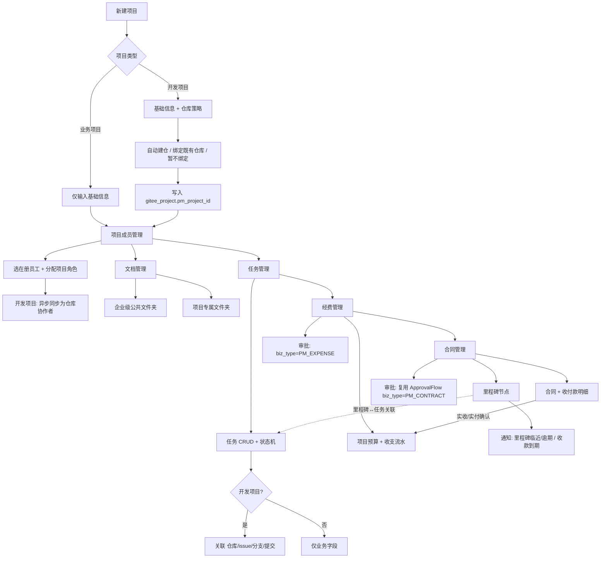
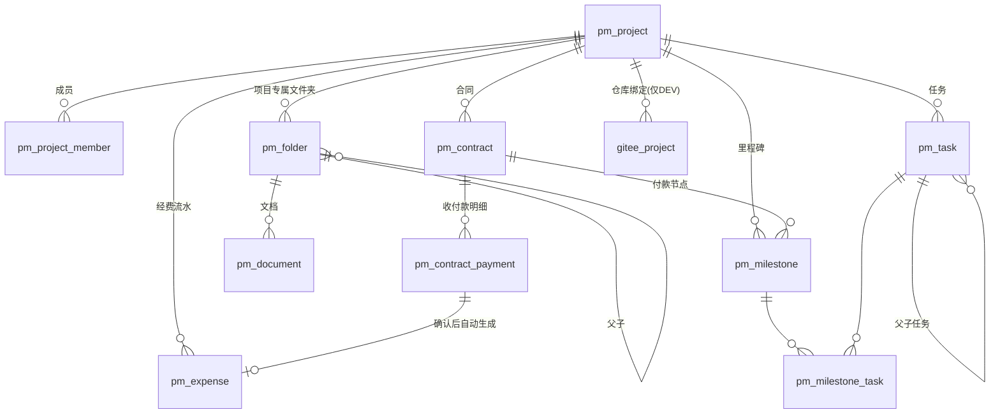

# 40 · 项目管理模块 · 设计与实施计划

## 1. 文档信息

| 项 | 内容 |
|---|---|
| 定位 | 业务系统新增模块：**项目管理（PM）**，覆盖 立项 → 成员 → 任务 → 文档 → 经费 → 合同 全链路 |
| 前置资产 | `docs/29`（Gitee 仓库联动 PRD）· `docs/30`（企业 Gitee 主动初始化）· `docs/33`（单端口部署）· `docs/38`（多租户领域模型） |
| 起始迁移版本 | **V71**（现库最新为 V70） |
| 新增后端模块 | `server/aioa-project` |
| 与 `docs/28` 的关系 | `docs/28 §6` 未列本项目 ⇒ 本模块为**新增范围**，不在既有「未开工项」清单内 |

---

## 2. 背景与目标

### 2.1 背景（与既有资产的实测对账）

动手前先把「已有的」和「看起来有其实没有的」分清，避免造重复资产：

| 既有资产 | 实际是什么 | 本模块怎么用 |
|---|---|---|
| `gitee_project` | **平台项目 ↔ Gitee 仓库映射**（`repo_name`/`gitee_owner`/`gitee_repo`/`webhook` 均 NOT NULL，状态 `CREATING/ACTIVE/FAILED/DELETED`） | **复用为「代码仓库绑定」**：追加 `pm_project_id` 空列。它承载不了业务项目（无仓库时必填项无从填写） |
| `gitee_task` | **异步任务队列（outbox）**：`task_type=CREATE_REPO/SYNC_MEMBER/...` | **不是业务任务**。⚠️ 命名冲突：新业务任务表必须叫 `pm_task`，禁止沿用 `*_task` 之外造成混淆 |
| `gitee_repo_member` | 仓库协作者 + `sync_status`（SYNCED/PENDING/FAILED） | 复用：项目成员变更后驱动其同步，界面直接展示同步状态 |
| `gitee_team` | 部门 ↔ Gitee 组织团队（`namespace` 做仓库命名前缀） | 复用：建仓时的部门隔离 |
| `biz_contract` / `biz_payment` | **演示业务数据集**（`V28__biz_dataset.sql`，由 `scripts/seed_biz_dataset.py` 生成，`tenant_id DEFAULT 0`），销售合同/收款，无明细行、无里程碑、无项目挂接 | **不复用**。真实合同管理另建 `pm_contract` 系列 |
| `cost_alloc_rule` / `cost_alloc_bill` | AI 用量**费用分摊**（按机构、按 period 出账） | **不是项目经费**，保持不动。项目经费另建 `pm_expense` |
| `sys_file` + `POST /api/v1/files/upload` | 文件字节落本地盘（`uploads/`），`GET /api/v1/files/{id}` 下载 | 复用为文档管理的**存储层** |
| `kb_document` / `kb_chunk` | 知识库文档（供检索/向量化，`state=OK/WAIT/FAILED`） | 不复用。项目文档是**文件夹化协作文档**，与知识库用途不同（见 §6 BR-07） |
| `approval_flow_def(tenant, institution, biz_type)` + `ApprovalFlowService` | **按 `biz_type` 参数化的通用审批引擎** | 复用：合同/经费审批只加 `biz_type` 种子，不改引擎 |
| `notification(type, ref_id)` | 站内通知，`type` 为字符串判别 | 复用：新增 `type=PM_MILESTONE / PM_CONTRACT_PAYMENT`，不改表结构 |
| `org_member` / `org_member_account`(V67) / `org_department` | 在册员工、员工↔账号中间表、部门 | 复用：项目成员只能从在册员工中选 |
| 对象存储 / 云盘 | **不存在**（全库无 MinIO/S3/OSS 依赖） | 「对接云端文件夹」需**先留抽象位**（§6 BR-07、§8.3） |

### 2.2 目标

1. 一套项目主数据同时承载 **业务项目** 与 **开发项目** 两种类型，**配置面由类型决定**。
2. 项目成员、任务、文档、经费、合同五个子域齐备，且互相可追溯。
3. 开发项目额外具备 **代码仓库绑定**，且任务可关联到仓库的 issue / 分支 / 提交。
4. 复用既有：仓库联动、审批引擎、站内通知、文件接口、组织与员工、权限目录。
5. **每个新能力都有可配入口 + 可断言判据**（铁律 4、铁律 5）。

### 2.3 非目标（本期不做）

- 不自研 Git 托管，不做代码浏览/合并请求（沿用 Gitee 侧，界面跳转原仓库）。
- 不做对象存储落地（本期用 `sys_file`；云盘走抽象位，见 §8.3）。
- 不做工时/费用报销审批表单的自定义设计器（复用既有审批表单能力）。
- 不引入独立的开源 PM 系统作为第二套运行时（理由见 ADR-007）。

---

## 3. 整体业务流程



### 3.1 端到端主流程（业务项目）

1. **立项**：项目经理在「项目管理 → 项目列表」新建，类型选 **业务项目**；填编号、名称、归属部门、起止日期、负责人、预算总额。提交即生效（`status=ACTIVE`），无需审批（可配置为走审批，见 BR-11）。
2. **组队**：在项目详情「成员」页签加人（只能从本机构在册员工里选），分配项目角色。业务项目不触发任何仓库同步。
3. **干活**：在「任务」页签建任务并分派；任务只有业务字段（负责人、起止、优先级、进度）。
4. **存证**：在「文档」页签建项目专属文件夹并上传文档；需要全员可见的资料放进「企业级公共文件夹」（挂载态，只读）。
5. **花钱**：在「经费」页签维护收支流水；也可由合同收款自动生成（BR-09）。
6. **签约**：在「合同」页签录合同 → 拆收付款计划 → 拆里程碑 → 里程碑关联任务；收款到期/里程碑临近触发站内通知。

### 3.2 端到端主流程（开发项目）

与业务项目的差异只有三处（其余完全复用）：

1. **立项时**多一步「仓库策略」：①自动建仓（走既有 `POST /api/v1/gitee/projects` 语义）②绑定既有仓库（选一个已存在的 `gitee_project`）③暂不绑定（可后补）。
2. **成员变更**会异步把成员同步为仓库协作者（复用 `gitee_repo_member.sync_status`），界面标签页多一列「仓库同步」。
3. **任务**多一组可选的仓库关联字段（仓库 / issue 号 / 分支 / 提交 SHA）。

> 业务项目的界面**不渲染**仓库相关配置项；后端也**不接受**其仓库字段（BR-01 双向守卫，不只做前端隐藏）。

### 3.3 项目状态机

```
DRAFT(草稿) → ACTIVE(进行中) → CLOSED(已结项)
                    ↘ SUSPENDED(暂停) ↗
任意状态 → ARCHIVED(已归档，只读)
```

- `CLOSED` / `ARCHIVED` 为只读终态：不允许再建任务、加成员、改合同。
- 软删（`deleted_at`）与状态正交：软删即从运营面退出，级联见 BR-14。

---

## 4. 功能菜单拆解

管理端左侧菜单「成果与项目」组重构（现有 `MainLayout.vue` 该组仅有「项目与仓库」一项）：

| 菜单 | 路由 | 权限码 | 说明 |
|---|---|---|---|
| **项目管理** | `/pm/projects` | `pm:project:view` | 主入口：项目列表 + 筛选 + 新建 |
| ↳ 项目详情 | `/pm/projects/:id` | `pm:project:view` | 六页签：概览 / 任务 / 成员 / 文档 / 经费 / 合同 |
| **企业文档** | `/pm/docs` | `pm:doc:view` | 企业级公共文件夹（跨项目） |
| 项目与仓库（既有） | `/gitee/projects` | `GITEE_VIEW_ROLES` | **保留不动**（V48 已验收 116 项）；项目详情「仓库」页签跳入此处详情 |
| 经费与分摊（既有） | `/cost-alloc` | `TENANT_SCOPE_ROLES` | **保留不动**：这是 AI 用量分摊，不是项目经费 |

新增权限码（三处必须同改，铁律 4）：

| 权限码 | 含义 | 建议授权角色 |
|---|---|---|
| `pm:project:view` | 查看项目（数据范围由 `sys_role.data_scope` 收窄） | 全部登录用户 |
| `pm:project:create` | 新建项目 | ADMIN / TENANT_ADMIN / ORG_ADMIN / DEPT_LEADER |
| `pm:project:manage` | 改项目基础信息、改状态、软删、绑/解绑仓库 | 项目 OWNER/PM + ADMIN / TENANT_ADMIN / ORG_ADMIN |
| `pm:member:manage` | 增删成员、分配项目角色 | 项目 OWNER/PM |
| `pm:task:manage` | 任务 CRUD | 项目 OWNER/PM/DEV |
| `pm:doc:manage` | 建文件夹、上传、删除 | 项目 OWNER/PM + 企业文档管理员 |
| `pm:budget:manage` | 经费流水维护 | 项目 OWNER/PM + TENANT_ADMIN |
| `pm:contract:manage` | 合同与收付款、里程碑维护 | 项目 OWNER/PM + TENANT_ADMIN |

落点（三处）：
1. `server/aioa-security/src/main/java/cn/aioa/security/PermissionCatalog.java`（权限点 → 允许角色集合）
2. `web/apps/shell/src/constants/permissions.ts`（与上者**一一对应**）
3. `sys_permission` 种子（`perm_code` 形如 `pm:project:view`，供权限申请链路使用）

---

## 5. 关键业务规则

每条给出**触发条件 / 判定点（唯一落点）/ 失败终态**。

| 编号 | 规则 | 判定点（唯一落点） | 失败终态 |
|---|---|---|---|
| **BR-01** | 项目类型决定配置面：`projectType=BUSINESS` 时**不接受**任何仓库配置 | 服务层 `ProjectTypeGuard.assertRepoAllowed(project, payload)`，**前端隐藏 + 后端校验双向** | 400 `业务项目不支持代码仓库配置` |
| **BR-02** | 项目类型**创建后默认不可改**；仅当「未绑定任何仓库 **且** 无任务带仓库信息」时允许 `DEV → BUSINESS` | `ProjectTypeGuard.assertTypeChangeable()` | 409 `已存在仓库关联，不能改为业务项目`（附冲突计数） |
| **BR-03** | 项目成员只能选**本租户在册员工**（`org_member.status='ACTIVE'` 且未软删） | `ProjectMemberService.add()` 查 `org_member` | 400 `该员工不在册` |
| **BR-04** | 移除成员 = 软删 `pm_project_member` **且**（开发项目）作废其仓库协作者（异步，走既有 outbox） | `ProjectMemberService.remove()` 同事务软删 + 入队 | 入队失败不回滚软删，但写 `sync_status=FAILED` 并可在界面重试（**不可逆动作不静默成功**） |
| **BR-05** | 项目内角色固定 5 档：`OWNER / PM / DEV / MEMBER / VIEWER`，**不支持租户自建角色** | 常量单入口（后端 `ProjectRoles` + 前端 `constants/projectRoles.ts`） | 400 `未知项目角色` |
| **BR-06** | 一个项目可绑多个仓库；绑定写 `gitee_project.pm_project_id`；**解绑只置空，不删仓库记录** | `ProjectRepoService.bind/unbind()` | 解绑不触发 Gitee 侧删除（只有 `purge_repo=1` 的软删项目才删仓库） |
| **BR-07** | 文档分两类：`ENTERPRISE`（企业级公共，跨项目，`pm_project_id IS NULL`）/ `PROJECT`（项目专属）。项目软删级联软删 `PROJECT` 类，**不动** `ENTERPRISE` 类 | `pm_folder.scope` + 级联服务 | 级联不物理删 `sys_file` 字节（保留可追溯） |
| **BR-08** | 文件夹**只允许删空文件夹**，无隐式递归删除 | `FolderService.delete()` | 409 `文件夹非空`（附子项计数） |
| **BR-09** | 合同收付款「确认实收/实付」时，在**同一事务**内自动生成一条 `pm_expense`（`contract_payment_id` 溯源）—— 单一事实源，禁止两边各记一遍 | `ContractPaymentService.confirm()` | 已确认的收付款不可删，只能**红冲**（写一条反向流水） |
| **BR-10** | 任务状态机 `TODO → DOING → DONE`（旁路 `BLOCKED` / `CANCELED`）；`DONE` 为终态不可回退 | `TaskService.transition()` 白名单转移表 | 400 `不允许从 DONE 转为 X`；父任务置 `DONE` 前校验子任务全 `DONE` |
| **BR-11** | 合同/经费审批复用既有引擎：新增 `approval_flow_def(biz_type='PM_CONTRACT' / 'PM_EXPENSE')` 种子；**未配置流程时按既有单节点兜底** | `ApprovalFlowService.submit(bizType=...)` | 沿用引擎既有语义，不改引擎 |
| **BR-12** | 任务仓库字段**成对约束**：`repo_id` 与 `repo_issue_no` 要么都空要么都有；仅 `DEV` 项目可写 | `TaskService.save()` + BR-01 守卫 | 400 `仓库与 issue 号必须同时提供` |
| **BR-13** | 里程碑达成：`plan_date` 必填；关联任务未全 `DONE` 时可强制达成，但必须记 `forced_by` + `forced_reason` | `MilestoneService.achieve()` | 缺理由 → 400；成功则落 `forced_*` 供审计 |
| **BR-14** | 项目软删级联：任务/成员/`PROJECT` 文件夹/文档索引/合同/收付款/里程碑**软删**；**不删** `gitee_project` 与 `sys_file` | `ProjectService.softDelete()` 单事务 | 任一级联失败整体回滚，项目不进入已删态（**每步失败都有终态**） |
| **BR-15** | 项目可见性 = 权限码 ∩ 数据范围：新增「我是成员」过滤，`data_scope=SELF` 时仅返回自己参与的项目 | `ProjectQuery` + `sys_role.data_scope` | 越界返回 403（不返回空列表，避免与「确实没有项目」混淆） |
| **BR-16** | 预算超支**不阻断**录入，但界面出警示并在合同确认收款时提示；超支阈值默认 100%，可配 | `BudgetService.overrunRatio()` 纯函数 | 不抛错（业务允许超支但要留痕） |

---

## 6. 数据表核心字段（V71 / V72 / V73 DDL 草案）

> 全部遵循现库约定：`tenant_id` 维度、软删 `deleted_at` + `alive` 虚拟生成列、
> 唯一键含 `alive`（铁律：**软删 + 唯一键 ⇒ 插入前必须先查软删行**）、`utf8mb4`。

### 6.1 V71 · 项目 / 成员 / 任务 / 仓库绑定

```sql
-- 项目主表：两种类型共用；类型决定配置面（BR-01）
CREATE TABLE `pm_project` (
    `id`             BIGINT       NOT NULL AUTO_INCREMENT PRIMARY KEY,
    `tenant_id`      BIGINT       NOT NULL,
    `project_no`     VARCHAR(64)  NOT NULL COMMENT '项目编号（租户内唯一）',
    `name`           VARCHAR(160) NOT NULL,
    `project_type`   VARCHAR(16)  NOT NULL COMMENT 'BUSINESS 业务项目 / DEV 开发项目',
    `status`         VARCHAR(16)  NOT NULL DEFAULT 'ACTIVE'
        COMMENT 'DRAFT / ACTIVE / SUSPENDED / CLOSED / ARCHIVED',
    `institution_id` BIGINT       NOT NULL COMMENT '归属机构',
    `department_id`  BIGINT       NOT NULL DEFAULT 0 COMMENT '归属部门',
    `owner_member_id` BIGINT      NULL COMMENT '项目负责人（org_member.id）',
    `budget_amount`  DECIMAL(18,2) NOT NULL DEFAULT 0 COMMENT '预算总额',
    `start_date`     DATE         NULL,
    `end_date`       DATE         NULL,
    `description`    VARCHAR(1024) NULL,
    `enterprise_folder_id` BIGINT NULL COMMENT '项目文档根文件夹（pm_folder.id）',
    `created_by`     BIGINT       NULL,
    `created_at`     DATETIME(6)  NOT NULL DEFAULT CURRENT_TIMESTAMP(6),
    `updated_at`     DATETIME(6)  NULL,
    `deleted_at`     DATETIME(6)  NULL,
    `alive`          TINYINT GENERATED ALWAYS AS (IF(`deleted_at` IS NULL, 1, NULL)) VIRTUAL,
    UNIQUE KEY `uk_pm_project_no` (`tenant_id`, `project_no`, `alive`),
    KEY `idx_pm_project_scope` (`tenant_id`, `institution_id`, `department_id`, `status`),
    KEY `idx_pm_project_type` (`tenant_id`, `project_type`, `status`)
) ENGINE = InnoDB DEFAULT CHARSET = utf8mb4 COMMENT '项目主表（业务/开发两类型共用）';

-- 项目成员 + 项目内角色（BR-03/04/05）
CREATE TABLE `pm_project_member` (
    `id`           BIGINT      NOT NULL AUTO_INCREMENT PRIMARY KEY,
    `tenant_id`    BIGINT      NOT NULL,
    `project_id`   BIGINT      NOT NULL,
    `member_id`    BIGINT      NOT NULL COMMENT 'org_member.id（在册员工）',
    `user_id`      BIGINT      NULL COMMENT 'sys_user.id，便于按登录人过滤',
    `role_code`    VARCHAR(16) NOT NULL DEFAULT 'MEMBER'
        COMMENT 'OWNER / PM / DEV / MEMBER / VIEWER',
    `perm_extra`   JSON        NULL COMMENT '预留：细粒度开关（本期不启用）',
    `repo_sync_status` VARCHAR(16) NOT NULL DEFAULT 'NA'
        COMMENT 'NA 业务项目无仓库 / SYNCED / PENDING / FAILED',
    `joined_at`    DATE        NULL,
    `created_by`   BIGINT      NULL,
    `created_at`   DATETIME(6) NOT NULL DEFAULT CURRENT_TIMESTAMP(6),
    `updated_at`   DATETIME(6) NULL,
    `deleted_at`   DATETIME(6) NULL,
    `alive`        TINYINT GENERATED ALWAYS AS (IF(`deleted_at` IS NULL, 1, NULL)) VIRTUAL,
    UNIQUE KEY `uk_pm_project_member` (`project_id`, `member_id`, `alive`),
    KEY `idx_pm_member_user` (`tenant_id`, `user_id`)
) ENGINE = InnoDB DEFAULT CHARSET = utf8mb4 COMMENT '项目成员与项目内角色';

-- 业务任务（注意：与 gitee_task「异步队列」无关，勿混用）
CREATE TABLE `pm_task` (
    `id`              BIGINT       NOT NULL AUTO_INCREMENT PRIMARY KEY,
    `tenant_id`       BIGINT       NOT NULL,
    `project_id`      BIGINT       NOT NULL,
    `parent_id`       BIGINT       NULL COMMENT '父任务（子任务），最多两级',
    `title`           VARCHAR(256) NOT NULL,
    `description`     VARCHAR(2048) NULL,
    `status`          VARCHAR(16)  NOT NULL DEFAULT 'TODO'
        COMMENT 'TODO / DOING / BLOCKED / DONE / CANCELED',
    `priority`        VARCHAR(8)   NOT NULL DEFAULT 'MEDIUM' COMMENT 'LOW / MEDIUM / HIGH / URGENT',
    `assignee_member_id` BIGINT    NULL COMMENT '负责人 org_member.id',
    `start_date`      DATE         NULL,
    `due_date`        DATE         NULL,
    `progress`        TINYINT      NOT NULL DEFAULT 0 COMMENT '0-100',
    -- 仓库关联：仅 DEV 项目可写（BR-01/BR-12）；BUSINESS 项目下四列恒为 NULL
    `repo_id`         BIGINT       NULL COMMENT 'gitee_project.id',
    `repo_issue_no`   VARCHAR(32)  NULL COMMENT '关联 issue 号',
    `repo_branch`     VARCHAR(128) NULL COMMENT '分支名',
    `repo_commit_sha` VARCHAR(64)  NULL COMMENT '关联提交 SHA',
    `created_by`      BIGINT       NULL,
    `created_at`      DATETIME(6)  NOT NULL DEFAULT CURRENT_TIMESTAMP(6),
    `updated_at`      DATETIME(6)  NULL,
    `deleted_at`      DATETIME(6)  NULL,
    `alive`           TINYINT GENERATED ALWAYS AS (IF(`deleted_at` IS NULL, 1, NULL)) VIRTUAL,
    KEY `idx_pm_task_project` (`tenant_id`, `project_id`, `status`),
    KEY `idx_pm_task_assignee` (`assignee_member_id`, `status`),
    KEY `idx_pm_task_repo` (`repo_id`)
) ENGINE = InnoDB DEFAULT CHARSET = utf8mb4 COMMENT '项目任务（业务任务，非异步队列）';

-- 仓库 ↔ 项目绑定：最小改动 = 既有表追加一列（零回归）
ALTER TABLE `gitee_project`
    ADD COLUMN `pm_project_id` BIGINT NULL COMMENT '归属项目 pm_project.id；空=未归属项目',
    ADD KEY `idx_gitee_project_pm` (`tenant_id`, `pm_project_id`);
```

### 6.2 V72 · 文档（文件夹 + 文档）

```sql
CREATE TABLE `pm_folder` (
    `id`           BIGINT       NOT NULL AUTO_INCREMENT PRIMARY KEY,
    `tenant_id`    BIGINT       NOT NULL,
    `scope`        VARCHAR(16)  NOT NULL COMMENT 'ENTERPRISE 企业级公共 / PROJECT 项目专属',
    `project_id`   BIGINT       NULL COMMENT 'scope=PROJECT 时必填',
    `parent_id`    BIGINT       NULL COMMENT '父文件夹，NULL=根',
    `name`         VARCHAR(128) NOT NULL,
    `path`         VARCHAR(512) NOT NULL COMMENT '物化路径 /1/12/，便于子树查询与防环',
    `storage_kind` VARCHAR(16)  NOT NULL DEFAULT 'LOCAL'
        COMMENT 'LOCAL 落 sys_file / CLOUD 云盘（抽象位，见 §8.3）',
    `cloud_ref`    VARCHAR(512) NULL COMMENT '云盘侧文件夹 id / path（storage_kind=CLOUD 时）',
    `created_by`   BIGINT       NULL,
    `created_at`   DATETIME(6)  NOT NULL DEFAULT CURRENT_TIMESTAMP(6),
    `updated_at`   DATETIME(6)  NULL,
    `deleted_at`   DATETIME(6)  NULL,
    `alive`        TINYINT GENERATED ALWAYS AS (IF(`deleted_at` IS NULL, 1, NULL)) VIRTUAL,
    UNIQUE KEY `uk_pm_folder` (`tenant_id`, `COALESCE(project_id,0)`, `parent_id`, `name`, `alive`),
    KEY `idx_pm_folder_path` (`tenant_id`, `path`(191))
) ENGINE = InnoDB DEFAULT CHARSET = utf8mb4 COMMENT '文档文件夹（企业级公共 / 项目专属）';

CREATE TABLE `pm_document` (
    `id`          BIGINT       NOT NULL AUTO_INCREMENT PRIMARY KEY,
    `tenant_id`   BIGINT       NOT NULL,
    `folder_id`   BIGINT       NOT NULL,
    `project_id`  BIGINT       NULL COMMENT '冗余项目维度，便于按项目聚合',
    `name`        VARCHAR(256) NOT NULL,
    `file_id`     BIGINT       NOT NULL COMMENT 'sys_file.id（字节实体）',
    `size_bytes`  BIGINT       NOT NULL DEFAULT 0,
    `version`     INT          NOT NULL DEFAULT 1 COMMENT '同名覆盖时自增',
    `tags`        VARCHAR(255) NULL,
    `uploaded_by` BIGINT       NULL,
    `created_at`  DATETIME(6)  NOT NULL DEFAULT CURRENT_TIMESTAMP(6),
    `updated_at`  DATETIME(6)  NULL,
    `deleted_at`  DATETIME(6)  NULL,
    `alive`       TINYINT GENERATED ALWAYS AS (IF(`deleted_at` IS NULL, 1, NULL)) VIRTUAL,
    UNIQUE KEY `uk_pm_document` (`folder_id`, `name`, `version`, `alive`),
    KEY `idx_pm_document_project` (`tenant_id`, `project_id`)
) ENGINE = InnoDB DEFAULT CHARSET = utf8mb4 COMMENT '项目/企业文档索引（字节落 sys_file）';
```

### 6.3 V73 · 经费 / 合同 / 里程碑

```sql
CREATE TABLE `pm_expense` (
    `id`                  BIGINT        NOT NULL AUTO_INCREMENT PRIMARY KEY,
    `tenant_id`           BIGINT        NOT NULL,
    `project_id`          BIGINT        NOT NULL,
    `direction`           VARCHAR(8)    NOT NULL COMMENT 'IN 收入 / OUT 支出',
    `category`            VARCHAR(32)   NOT NULL COMMENT '合同款/人工/采购/差旅/其他',
    `amount`              DECIMAL(18,2) NOT NULL,
    `occurred_at`         DATE          NOT NULL,
    `contract_payment_id` BIGINT        NULL COMMENT '来源：合同收付款确认后自动生成（BR-09）',
    `voucher_file_id`     BIGINT        NULL COMMENT '凭证 sys_file.id',
    `reversal_of`         BIGINT        NULL COMMENT '红冲：指向被冲销的流水 id',
    `remark`              VARCHAR(512)  NULL,
    `created_by`          BIGINT        NULL,
    `created_at`          DATETIME(6)   NOT NULL DEFAULT CURRENT_TIMESTAMP(6),
    `updated_at`          DATETIME(6)   NULL,
    `deleted_at`          DATETIME(6)   NULL,
    `alive`               TINYINT GENERATED ALWAYS AS (IF(`deleted_at` IS NULL, 1, NULL)) VIRTUAL,
    KEY `idx_pm_expense_project` (`tenant_id`, `project_id`, `occurred_at`),
    KEY `idx_pm_expense_payment` (`contract_payment_id`)
) ENGINE = InnoDB DEFAULT CHARSET = utf8mb4 COMMENT '项目经费收支流水';

CREATE TABLE `pm_contract` (
    `id`            BIGINT        NOT NULL AUTO_INCREMENT PRIMARY KEY,
    `tenant_id`     BIGINT        NOT NULL,
    `project_id`    BIGINT        NOT NULL,
    `contract_no`   VARCHAR(64)   NOT NULL,
    `name`          VARCHAR(256)  NOT NULL,
    `direction`     VARCHAR(8)    NOT NULL COMMENT 'IN 收款合同（我方开票）/ OUT 付款合同',
    `party_name`    VARCHAR(256)  NOT NULL COMMENT '对方单位',
    `amount`        DECIMAL(18,2) NOT NULL DEFAULT 0,
    `status`        VARCHAR(16)   NOT NULL DEFAULT 'DRAFT'
        COMMENT 'DRAFT / PENDING_APPROVAL / SIGNED / EXECUTING / CLOSED / TERMINATED',
    `approval_order_id` BIGINT    NULL COMMENT '复用审批引擎（biz_type=PM_CONTRACT）',
    `signed_at`     DATE          NULL,
    `start_date`    DATE          NULL,
    `end_date`      DATE          NULL,
    `file_id`       BIGINT        NULL COMMENT '合同扫描件 sys_file.id',
    `created_by`    BIGINT        NULL,
    `created_at`    DATETIME(6)   NOT NULL DEFAULT CURRENT_TIMESTAMP(6),
    `updated_at`    DATETIME(6)   NULL,
    `deleted_at`    DATETIME(6)   NULL,
    `alive`         TINYINT GENERATED ALWAYS AS (IF(`deleted_at` IS NULL, 1, NULL)) VIRTUAL,
    UNIQUE KEY `uk_pm_contract_no` (`tenant_id`, `contract_no`, `alive`),
    KEY `idx_pm_contract_project` (`project_id`, `status`)
) ENGINE = InnoDB DEFAULT CHARSET = utf8mb4 COMMENT '项目合同';

CREATE TABLE `pm_contract_payment` (
    `id`             BIGINT        NOT NULL AUTO_INCREMENT PRIMARY KEY,
    `tenant_id`      BIGINT        NOT NULL,
    `contract_id`    BIGINT        NOT NULL,
    `seq`            INT           NOT NULL COMMENT '第几期',
    `plan_amount`    DECIMAL(18,2) NOT NULL COMMENT '计划金额',
    `plan_date`      DATE          NULL COMMENT '计划收付款日',
    `actual_amount`  DECIMAL(18,2) NOT NULL DEFAULT 0,
    `actual_date`    DATE          NULL,
    `status`         VARCHAR(16)   NOT NULL DEFAULT 'PLANNED'
        COMMENT 'PLANNED / CONFIRMED / REVERSED',
    `milestone_id`   BIGINT        NULL COMMENT '若为里程碑付款条件，指向 pm_milestone',
    `voucher_file_id` BIGINT       NULL,
    `created_at`     DATETIME(6)   NOT NULL DEFAULT CURRENT_TIMESTAMP(6),
    `updated_at`     DATETIME(6)   NULL,
    `deleted_at`     DATETIME(6)   NULL,
    `alive`          TINYINT GENERATED ALWAYS AS (IF(`deleted_at` IS NULL, 1, NULL)) VIRTUAL,
    UNIQUE KEY `uk_pm_contract_payment` (`contract_id`, `seq`, `alive`),
    KEY `idx_pm_payment_plan` (`tenant_id`, `plan_date`, `status`)
) ENGINE = InnoDB DEFAULT CHARSET = utf8mb4 COMMENT '合同收付款明细（计划/实收）';

CREATE TABLE `pm_milestone` (
    `id`           BIGINT       NOT NULL AUTO_INCREMENT PRIMARY KEY,
    `tenant_id`    BIGINT       NOT NULL,
    `project_id`   BIGINT       NOT NULL,
    `contract_id`  BIGINT       NULL COMMENT '关联合同（付款节点型里程碑）',
    `name`         VARCHAR(160) NOT NULL,
    `plan_date`    DATE         NOT NULL,
    `actual_date`  DATE         NULL,
    `status`       VARCHAR(16)  NOT NULL DEFAULT 'PENDING'
        COMMENT 'PENDING / ACHIEVED / DELAYED / CANCELED',
    `forced_by`    BIGINT       NULL COMMENT '关联任务未全完成时强制达成者（BR-13）',
    `forced_reason` VARCHAR(255) NULL,
    `created_by`   BIGINT       NULL,
    `created_at`   DATETIME(6)  NOT NULL DEFAULT CURRENT_TIMESTAMP(6),
    `updated_at`   DATETIME(6)  NULL,
    `deleted_at`   DATETIME(6)  NULL,
    `alive`        TINYINT GENERATED ALWAYS AS (IF(`deleted_at` IS NULL, 1, NULL)) VIRTUAL,
    KEY `idx_pm_milestone_project` (`tenant_id`, `project_id`, `plan_date`),
    KEY `idx_pm_milestone_contract` (`contract_id`)
) ENGINE = InnoDB DEFAULT CHARSET = utf8mb4 COMMENT '项目里程碑（可挂合同、可关联任务）';

CREATE TABLE `pm_milestone_task` (
    `id`           BIGINT      NOT NULL AUTO_INCREMENT PRIMARY KEY,
    `tenant_id`    BIGINT      NOT NULL,
    `milestone_id` BIGINT      NOT NULL,
    `task_id`      BIGINT      NOT NULL,
    `created_at`   DATETIME(6) NOT NULL DEFAULT CURRENT_TIMESTAMP(6),
    `deleted_at`   DATETIME(6) NULL,
    `alive`        TINYINT GENERATED ALWAYS AS (IF(`deleted_at` IS NULL, 1, NULL)) VIRTUAL,
    UNIQUE KEY `uk_pm_milestone_task` (`milestone_id`, `task_id`, `alive`)
) ENGINE = InnoDB DEFAULT CHARSET = utf8mb4 COMMENT '里程碑 ↔ 任务 关联（M:N）';
```

**表清单小结**：新增 11 张 `pm_*` 表 + `gitee_project` 追加 1 列。
`pm_project` / `pm_project_member` / `pm_task`（V71）· `pm_folder` / `pm_document`（V72）·
`pm_expense` / `pm_contract` / `pm_contract_payment` / `pm_milestone` / `pm_milestone_task`（V73）。

### 6.4 实体关系



---

## 7. 页面交互逻辑

### 7.1 新建项目（三步向导）

| 步骤 | 业务项目 | 开发项目 |
|---|---|---|
| ① 基础信息 | 编号/名称/归属机构部门/负责人/起止/预算/描述 | 同左 |
| ② 类型相关 | **跳过**（界面直接提示「业务项目无需仓库配置」） | 仓库策略：自动建仓 / 绑定既有 / 暂不绑定 |
| ③ 成员与角色 | 选负责人 + 初始成员，分配项目角色 | 同左，并提示「成员将同步为仓库协作者」 |

交互要点：
- **类型是第 ① 步的必选项**，且是后续步骤渲染的开关（`projectType` 单一事实源）。
- 「绑定既有仓库」列表只返回 `pm_project_id IS NULL` 的仓库（一个仓库不归两个项目）。
- 「自动建仓」失败**不阻断立项**：项目落 `ACTIVE`，仓库侧记 `status=FAILED` + `error_msg`，详情页「仓库」页签提供「重试」（复用既有 `POST /gitee/projects/{id}/retry` 语义）。

### 7.2 项目详情六页签

| 页签 | 关键交互 |
|---|---|
| **概览** | 状态卡（状态/类型/负责人/起止）、预算执行条（预算 / 已支出 / 结余，超支标红）、任务完成率、里程碑时间轴（近 3 个）、最近文档 |
| **任务** | 列表/看板双视图；父子树；批量改状态；**开发项目**才显示「仓库 / Issue / 分支 / 提交」列与筛选；拖拽改状态走 `TaskService.transition()`（非法转移前端拦截 + 后端兜底） |
| **成员** | 成员表：员工 / 项目角色 / 加入时间 / **仓库同步状态**（开发项目才显示该列，`FAILED` 行给「重试同步」）；加人弹窗按部门树选在册员工 |
| **文档** | 左树右列表；顶部两个根：`企业级公共文件夹`（只读挂载，写操作给出「请在企业文档页维护」提示）/ `项目专属文件夹`；上传走 `POST /api/v1/files/upload` 后落 `pm_document` |
| **经费** | 预算卡片 + 流水表；「来源」列展示合同收付款溯源（可点回合同）；红冲按钮只对已确认流水出现 |
| **合同** | 合同卡片（状态徽标）→ 合同抽屉：收付款计划表（含「确认收付款」）+ 里程碑列表（可关联任务，多选）+ 合同附件 |

### 7.3 类型相关字段的显隐口径（关键）

- 前端：`v-if="project.projectType === 'DEV'"` 单一判据，禁止在多处各写一遍条件。
- 后端：`ProjectTypeGuard` 校验（BR-01），**前端隐藏不是安全边界**。
- 判据自检（写进套件）：`projectType=BUSINESS` 的项目详情页 DOM 内**不得出现** `仓库`/`Issue`/`分支` 任一文案节点；同一套件对 `DEV` 项目断言**必须出现**（双向断言，防「两边都不渲染」的假绿）。

---

## 8. 开源借鉴与取舍

### 8.1 结论（详见 `docs/adr/ADR-007`）

**借鉴领域模型与交互范式，不嵌入第二套运行时。**
理由：本项目是 Spring Boot 3 单体 + Vue3 + 多租户 + 权限目录单入口 + 单端口部署（`docs/33`）。
引入 OpenProject/Redmine/Taiga 这类独立系统会带来**第二套账号、第二套权限、第二套部署**，
与「权限码单入口」「单端口」两条既有硬约束直接冲突，且它们的租户模型与本项目六层模型（`docs/38`）对不上。

### 8.2 借鉴清单

| 借鉴对象 | 借鉴什么（落到本设计哪一处） | 不借鉴什么 |
|---|---|---|
| **Redmine** | ①**角色 × 权限矩阵**的思路 → `pm_project_member.role_code` + `PermissionCatalog` 的 `pm:*` 权限点；②**按项目开关模块** → 正是「业务项目不显示仓库配置」的范式来源（BR-01/§7.3） | 其多项目的「每项目独立模块配置页」（本项目按类型固定，不做逐项目开关，避免配置爆炸） |
| **OpenProject** | 「工作包（work package）= 类型 + 状态 + 负责人 + 起止 + 关联」的字段模型 → `pm_task`；预算与成本的「计划 vs 实际」对照 → `pm_project.budget_amount` vs `pm_expense` | 甘特图/基线/依赖链（本期不做，`parent_id` 已留扩展位） |
| **Taiga** | 任务看板与状态流转的交互（列表/看板双视图、拖拽改状态、非法流转拦截） | 敏捷专有概念（史诗/冲刺/故事点） |
| **ERPNext** | 合同的**里程碑付款条件**（Payment Terms → 分期货款 ↔ 里程碑） → `pm_contract_payment.milestone_id` + `pm_milestone` 的绑定关系 | 其会计凭证体系（本项目经费只做项目台账，不动财务总账） |
| **Gitea / GitLab** | **已在本项目内的既有实现**：issue / 分支 / 提交 / 里程碑 ↔ 代码仓库的双向关联范式 → `pm_task.repo_*` 字段与跳转原仓库 | 不自研 Git 托管（沿用 Gitee 侧） |

### 8.3 「对接云端文件夹」的落地口径（重要）

现状：**全库无对象存储/云盘依赖**，文件字节落本地盘（`sys_file` + `uploads/`）。

落地策略（两步走，边界清晰）：

1. **本期**：`pm_folder.storage_kind='LOCAL'`，字节经 `POST /api/v1/files/upload` 落 `sys_file`。
   企业级公共文件夹与项目专属文件夹**同库同表**，仅以 `scope` 区分 —— 界面分两块，实现一套。
2. **接云盘时**：只新增一个 `CloudStorageProvider` 接口（`mkdir / upload / download / delete`），
   `pm_folder.storage_kind` 切 `CLOUD` 时把 `cloud_ref` 作为云盘侧路径；**表结构不变、上层服务不改**。
   判据：新增 provider 时只需实现该接口 + 一份配置，不改 `pm_folder`/`pm_document` 的 DDL。

> 若云端文件夹指的是**已有第三方网盘**（如企业微信/钉钉盘），需先确认是否提供开放 API —— 这是本设计唯一需要外部输入的点，见 §10 开放项 R-01。

---

## 9. 实施批次与验收口径

| 批次 | 内容 | 迁移 | 必跑/新增验收 |
|---|---|---|---|
| **1** | 项目 CRUD + 类型守卫 + 成员 + 仓库绑定 | V71 | 新增 `scripts/_check_pm_guards.py`（**负向**：`BUSINESS` 提交 repo 字段必须 400；`DEV→BUSINESS` 有仓库时必须 409）；`_check_delete_guards.py` 补项目级联项 |
| **2** | 任务 CRUD + 状态机 + 里程碑↔任务关联 | 无（表已在 V71/V73） | 状态机白名单负向用例（`DONE→DOING` 必须 400）；父子任务校验 |
| **3** | 文档：文件夹树 + 文档挂接 | V72 | 文件夹删空校验（非空 409）；企业级 vs 项目专属的级联差异断言 |
| **4** | 经费 + 合同 + 收付款 + 里程碑 + 审批/通知复用 | V73 | 收付款确认 → 自动生成流水（同事务，断言**恰好 1 条**）；红冲不删原流水；`biz_type=PM_CONTRACT` 走通既有审批引擎 |

**每批硬性纪律**（沿用本项目既有约定）：
- 改权限/可见性口径 ⇒ **连跑两次**（铁律 8）。
- 管理端逐角色**分进程**跑 E2E（铁律 9）。
- 新增可配置维度（如 `projectType`）⇒ 必须为该组合补断言（铁律 5）。
- 断言「界面展示了某事实」时，判据回**接口真值**取一次，不读界面数据副本（铁律 12）。
- 后端模块注册点：`server/pom.xml` 加 `aioa-project`、`aioa-boot` 加依赖；控制器沿用 `/api/v1/**` 即自动被单端口前缀过滤器覆盖（沿用既有 `AioaPathPrefixSupport`，无需额外配置）。

---

## 10. 风险与开放项

| 编号 | 项 | 默认建议（可直接执行，不必等确认） |
|---|---|---|
| R-01 | 「云端文件夹」是否指某第三方网盘（企业微信/钉钉/自有 OSS） | **按自有对象存储预留抽象位**（§8.3），本期落本地；若确指第三方网盘，只替换 provider 实现 |
| R-02 | 项目类型是否允许事后变更 | **默认允许 `DEV→BUSINESS` 且仅当无仓库关联**（BR-02）；反向不允许（业务项目无仓库信息可迁移） |
| R-03 | 项目内角色是否允许租户自建 | **默认不允许**（固定 5 档）。自建角色会让权限矩阵不可穷举、无法写断言 |
| R-04 | 预算超支是否阻断 | **默认不阻断、只警示 + 留痕**（BR-16）；确需阻断时把阈值配置项从 100% 下调 |
| R-05 | 与既有 `gitee_project` 的界面关系 | 「项目与仓库」菜单**保留**（V48 已验收 116 项，不动它）；项目详情的「仓库」页签跳入其详情页，避免双入口各建一套 |
